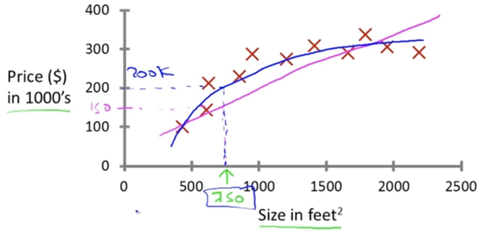
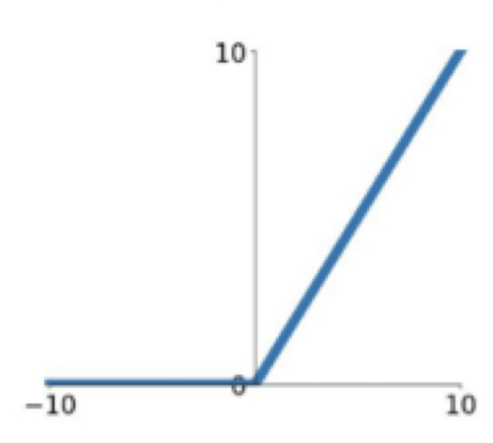
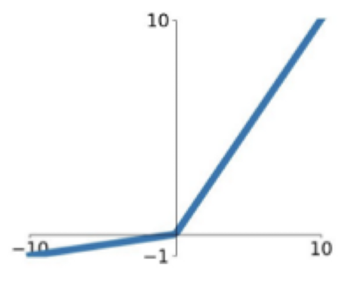
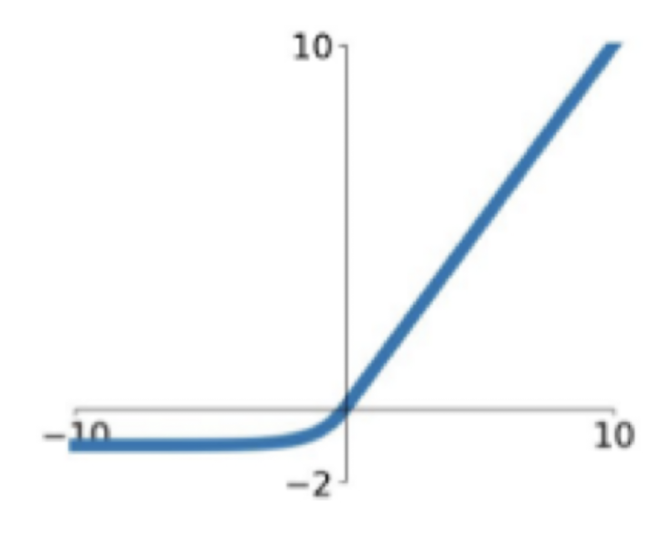
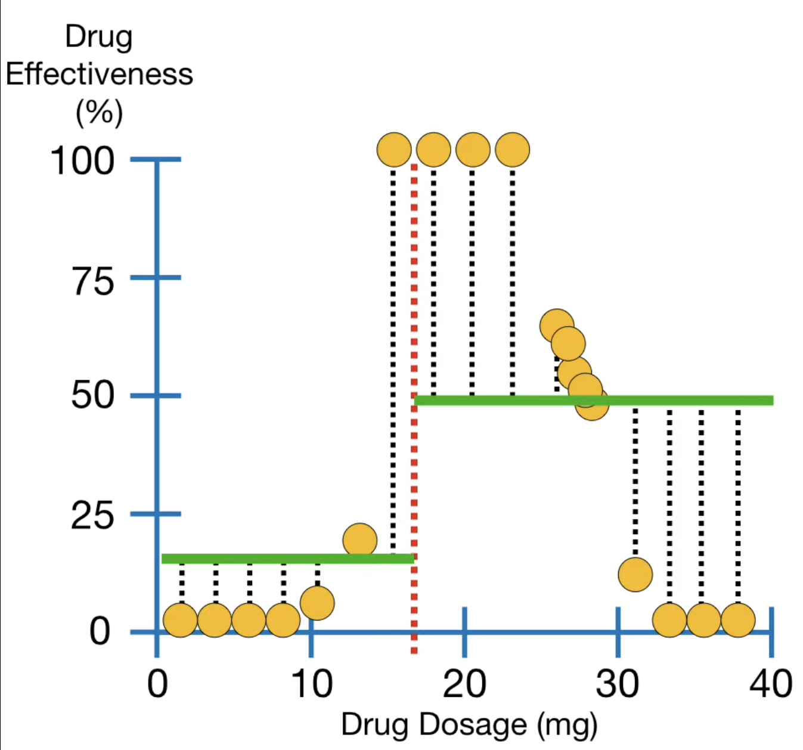
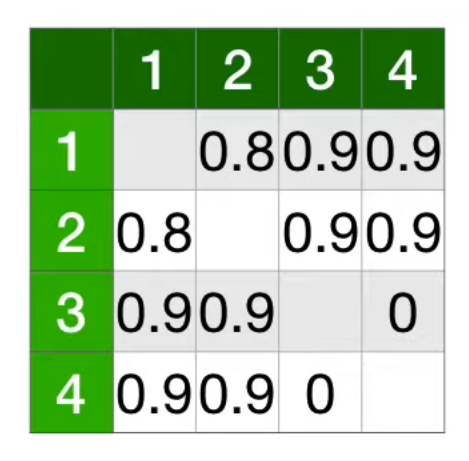
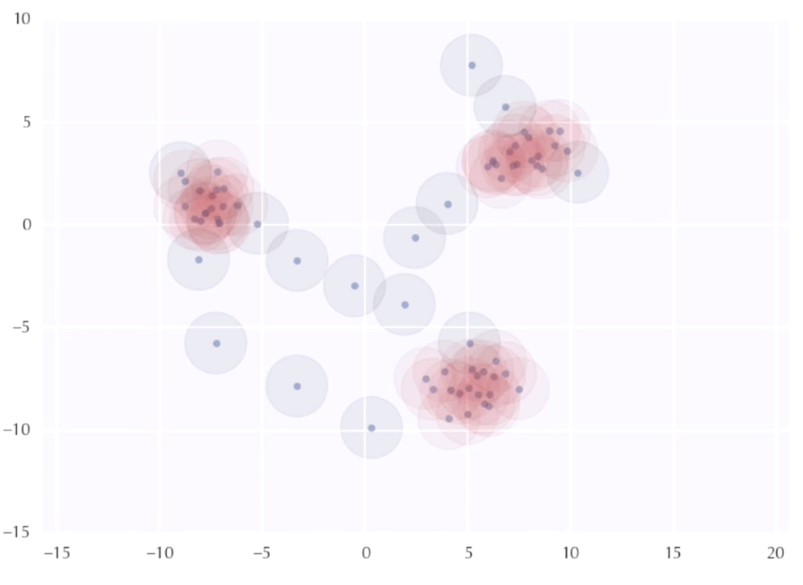
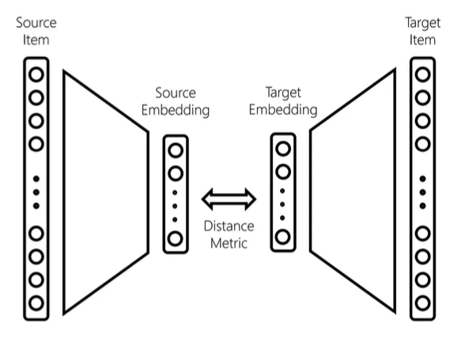

# Machine Learning Notes
A.Y. 2023-2024, Polytechnic of Bari
Professor: Tommaso di Noia
Author: Vito Di Bari
## Reading suggestions
<aside>
⚠️ Purple sections are AI-generated
</aside>
<aside>
⚠️ Green sections are deep divings, so not mandatory for the exam
</aside>
### Long demonstrations
The following ones must be memorized for the mid-term exam.
1. Probabilistic interpretation of Linear Regression (see [[#Probabilistic interpretation]])
2. Calculus of MSE and GER (see [[#Bias and Variance trade-off]])
3. [Derivative of $J(\theta)$](https://www.notion.so/Machine-Learning-Notes-fd12021b7a554122bce07e4233196a54?pvs=21)
4. [Calculus of $J(\theta)$ for logistic regression](https://www.notion.so/Machine-Learning-Notes-fd12021b7a554122bce07e4233196a54?pvs=21)
5. [[#Proof of Normal equations]]
### Exercises
1. [[#Feature Scaling]]
2. [[#Gradient Descent]] by hand
3. [[#Outlier removal - boxplot]]
4. Curves (in general)
5. [[#Learning Curves]]
# 1. Introduction
What is ML? **Machine Learning** is the field of study that gives to a program the ability to learn even if not explicitly programmed. 

A well-posed **Machine Learning program** definition can be: 
a computer program is said to *learn* from experience $E$, w.r.t. some task $T$ and a performance measure $P$, if its performance on $T$, as measured by $P$, improves with experience $E$.

Of course, there are many other valid definitions.
## 1st classification
### Supervised Learning
The idea is to learn a mapping from given **inputs** $x$ and given **outputs** $y$.

Given a **training set** (or labeled set) $D=\{(x_i,y_i)\}^N_{i=1}$, where $N$ is the number of training samples, each training input $x_i$, called **feature** or **attribute** is a $D$-dimensional vector of values (even a complex type of value). The output or **response variable** $y$ is made up **categorical** or **nominal** values defined in some finite set $y_i\in\{1,...,C\}$ or in a continuous domain (a real value).

The type of $y_i$ gives the type of the problem:
- $y_i$ is **categorical** → **classification** or **pattern recognition problem**
- $y_i$ is **real-valued** → **regression problem**
- **$y_i$** has some **natural ordering** → **ordinal regression problem**

Once the input data is fed into the model, it can adjust its weights by itself, using the Gradient Descent algorithm, until it fits approximately the scenario.

ML problems consists mostly in:
- **Classification**: the goal is to <u>predict discrete output values</u>.
- **Regression**: the goal is to <u>predict continuous (real) output values</u>.
#### Examples
**Housing price prediction**
  
  
  Given a finite set of data, I could consider a linear or quadratic model to predict the price, given the size of the house. In the supervised approach, the right answer will be given for each datapoint.
  This is a regression problem: I want the algorithm to predict the price of an house, a real value.
  
  **Breast cancer**

I want the algorithm to decide if a tumor is malignant or not, given the size. 
This is an example of (binary) classification problem: given a certain tumor size, the algorithm should be able to return the chance that the tumor is malignant (or not). The tumor size is the feature of the problem.

In general, I can have more types of (discrete) output values, so a multi-class output problem.
In general, I can have more feature values (even $\infty$, with a mathematical trick), like in the following variant of the example.

In this case, there are two features: tumor size and age. I could consider a line dividing two “clusters” of data.
### Unsupervised Learning
In this case, there is <u>no input labels</u>: the analysis is done just on *output data* of a scenario and the objective is to discover *interesting structures* in the data; this practice also is defined **knowledge discovery**. Available data is not labeled; indeed, the aim is not to classify labels, but to <u>find interesting behaviors between given data</u>.

Unlike supervised learning, it is not told what the expected output is and there is no obvious error metric to use.

Unsupervised learning is more typical of human and animal learning.
#### Examples
**Example - Google News**
Each day, Google takes hundred of thousands of news and try to group them into categories or, using math language, group them into clusters. The interesting thing is that I don’t know categories a priori: the number of categories is given by the number of clusters found; once the clustering is finished, I can label each cluster with the category name.

Other example can be: grouping social network’s friends, market segmentation (find customer segments), astronomical analysis.
### Semi-supervised Learning
Semi-supervised learning is a machine learning approach that <u>combines elements of both supervised and unsupervised learning</u>. It uses a small amount of labeled data initially, along with a large amount of unlabeled data later in the training process. This approach is particularly useful when obtaining labeled data is expensive or time-consuming, but unlabeled data is abundant.

Key characteristics of semi-supervised learning include:
- leverages both labeled and unlabeled data
- can improve learning accuracy
- useful when labeled data is scarce but unlabeled data is plentiful

Common applications of semi-supervised learning include speech analysis, protein sequence classification, and web content classification.
### Reinforcement Learning
This kind of model is made to <u>learn tasks automatically by doing random actions and getting rewarded if the action is a good one, otherwise the model gets punished</u>.

A reinforcement learning model is an artificial intelligence approach where an agent learns to make decisions by interacting with an environment. The key components of reinforcement learning are:
- Agent: The learner or decision-maker
- Environment: The world that the agent interacts with
- Actions: What the agent can do
- States: The current situation of the agent
- Rewards: Feedback from the environment

The agent's **goal** is to learn a policy - a strategy for choosing actions - that maximizes the cumulative reward over time. This is achieved through trial and error: the agent explores the environment, takes actions, observes the consequences (rewards and new states), and adjusts its strategy accordingly.

<u>Unlike supervised learning, reinforcement learning doesn't rely on labeled training data. Instead, it learns from the consequences of its actions, making it particularly suitable for problems where an optimal behavior is not known in advance but can be discovered through interaction.</u>

Common applications of reinforcement learning include game playing (e.g., AlphaGo), robotics, autonomous vehicles, and resource management.
### Recommender Systems
A recommender system is a type of information filtering system that seeks to <u>predict the preferences or ratings a user would give to an item</u>.

These systems are used in various applications, such as suggesting products to purchase, content to consume, or social connections to make. They analyze patterns in user behavior and preferences to provide personalized recommendations.
## 2nd classification
### Discriminative Models
Discriminative models focus on directly predicting the conditional probability distribution $P(Y|X)$, where $Y$ is the output label and $X$ is the input features. <u>These models learn the decision boundary between different classes without modeling the underlying distribution of the data.</u>

Key characteristics of discriminative models include:
- They directly model the probability of an output given the input
- They typically require less training data compared to generative models
- Examples include logistic regression, support vector machines (SVM), and neural networks

Discriminative models are often preferred when the primary goal is prediction accuracy and when there's sufficient labeled training data available.
### Generative Models
Generative models, in contrast to discriminative models, learn the joint probability distribution $P(X,Y)$ of both the input features $X$ and the output labels $Y$. T<u>hese models can generate new data points and are particularly useful when understanding the underlying data distribution is important.</u>

Key characteristics of generative models include:
- They model how the data was generated
- They can handle missing data more naturally
- They can generate new, synthetic data points
- Examples include Naive Bayes, Hidden Markov Models, and Generative Adversarial Networks (GANs)

Generative models are often used in unsupervised learning tasks and can be beneficial when the amount of labeled data is limited.
## Principles
### Ockham’s razor
- The simplest answer is usually the correct answer
- Simplicity is the ultimate sophistication
- <u>Of two equivalent theories or explanations, all other things being equal, the simpler one is to be preferred</u>
- We are to admit no more causes of natural things than such as are both true and sufficient to explain their appearances (?)
- The simplest explanation is usually the best

The “razor” metaphor reflects the principle of “shaving away” unnecessary assumptions in reasoning.
### No Free Lunch (NFL) Theorem
<u>If an algorithms performs well on a certain class of problems, then it necessarily performs bad on the set of all remaining problems.</u>
<u>No algorithm can give good results in all problems.</u>

It can be seen in a mathematical way:

$$
\sum_f P(d_m^y|f,m,a_1) = \sum_f P(d_m^y|f,m,a_2)
$$

Where:
- $a_1$ and $a_2$ are two algorithms
- $d_m^y$ is the ordered set of size $m$ of the cost values $y \in Y$ associated to input values $x \in X$
- $f:X \rightarrow Y$ is the function being optimized
- $P$ is the conditional probability of obtaining a given sequence of cost values from algorithm $a$ run $m$ times on function $f$

It says that the average of the performance over all the optimizations on problem $f$ is always the same.

There’s “no free lunch” in real life: you don’t get something for nothing.
# —Supervised Learning—
# 2. Linear Regression
> [!info] Notation
> - $m$ = number of **training examples**
> - $x$ = input variable(s) or **feature**(s)
> - $y$ = output variable or **target**
> - $(x,y)$ = tuple that represent one training session
> - $(x^{(i)},y^{(i)})$ = $i^{th}$ training example

Given the training set and a learning algorithm, the main objective of linear regression is to build a function called **hypothesis** 
$$
h_\theta(x)=\theta_0+\theta_1x_1+\theta_2x_2...
$$
## Univariate (Linear)
The shape of the hypothesis with $\theta_i$ parameters is the following one:
$$
h_\theta(x)=\theta_0+\theta_1x
$$

N.B.: $\theta_0$ is also called **bias.**

The idea is to find the best vector of parameters  $\theta$ so that $h(x)$ is as close as possible to the $y$s of the training example. In order to do that a **cost function** $J(\theta_0, \theta_1)$ is needed: $J$ gives the value of the error between the model using parameters $(\theta_0, \theta_1)$ and the training set.
$$
J(\theta_0, \theta_1)=
J(\theta)=
\frac1{2m}\sum_{i=1}^m(h_\theta(x^{(i)})-y^{(i)})^2
$$
$$
\theta_{min}
=\min[J(\theta_1, \theta_2)]
=\min[J(\theta)]
$$

## Multivariate (Linear)
Some notation like the previous case and in addition:
* $x_j^{(i)}$ value of $j^{th}$ feature in $i^{th}$ training example
$$
h_\theta(x^{(i)})=\theta_0+\theta_1x_1^{(i)}+\theta_2x_2^{(i)}+...+\theta_nx_n^{(i)}
$$
$$
\textbf{x}=\begin{bmatrix} 
x_0 \\
x_1 \\
x_2 \\
\vdots \\
x_n
\end{bmatrix}
\in \mathbb R^{n+1}
\quad
\theta=
\begin{bmatrix} 
\theta_0 \\ 
\theta_1 \\ 
\theta_2 \\
\vdots \\
\theta_n
\end{bmatrix}
\in \mathbb R^{n+1}
\quad
h_\theta(x^{(i)})=\theta^T\textbf{x}|_{x_0=1}
$$
## Gradient Descent
Also known as **steepest descent**.

The **Gradient Descent Algorithm** is used to (iteratively) minimize the cost function $J(\theta_0, \theta_1)$ by changing $\theta_0$ and $\theta_1$. The steps are the following:

1. initialize $\theta_0$ and $\theta_1$ to some random values
2. keep changing $\theta_0$ and $\theta_1$ to reduce $J(\theta_0, \theta_1)$, towards the minimum value, using the step update:
$$
\theta_j \coloneqq \theta_j - \alpha\frac{\partial}{\partial\theta_j}J(\theta_0, \theta_1)
$$
It’s crucial to set an appropriate value for the **learning rate** $\alpha$. The value to assign to it is a trade-off because:
- if $\alpha$ s too small, then the algorithm will converge slowly

- if $\alpha$ it’s too large, the algorithm may diverge

> [!tip]
> Moreover, the gradient descent has a particular property: as long as the algorithm goes, the steps gets automatically lower because of the derivative component: it gets lower as well.

The following are three possibile implementations of the Gradient Descent Algorithm:
### Batch Gradient Descent
1. Randomly initialize parameters $\theta$
2. For each parameter, the parameter $\theta_j$ is updated using all the $m$ training data until convergence (stop criteria is met)
$$
\theta_j 
\coloneqq \theta_j - \alpha\frac{\partial}{\partial\theta_j}J(\theta_j)
= \theta_j - \alpha\frac1m\sum_{i=1}^m(h_\theta(\textbf{x}^{(i)})-y^{(i)})\textbf{x}_j^{(i)}
\\
for \: j=0,1,2,...,n
$$
### Stochastic Gradient Descent

1. Randomly initialize parameters $\theta$
2. For each sample data $i$, all $n$ parameters are updated all at once, until convergence (stop criteria is met)
$$
\theta_j 
\coloneqq  \theta_j - \alpha(h_\theta(\textbf{x}^{(i)})-y^{(i)})\textbf{x}_j^{(i)}
\\
\quad
\text{for} \space j=0,1,2,...,n
$$
It is called “stochastic” because, given the fact that parameters are all updated after each training example, the value of the gradient is always a “stochastic approximation” of the true cost gradient. 

An **approximate gradient** means a faster but zig-zag-ish convergence, because the model “gets fixed” (all parameters are updated) each time a new data is used in the update step.

For large datasets, stochastic gradient descent is preferred to batch gradient descent.

### Mini-Batch Gradient Descent
This approach tries to take the advantages of batch and stochastic ones: 
1. given a parameter $b\in[2,100]$ (usual values)
2. all $n$ parameters are updated using $b$ samples among the totality of them (**mini-batch** sampled from the entire dataset)
3. the step 2. is repeated for every mini-batch, until all of them have been considered

In general, when a dataset is particularly big, the stochastic or mini-batch approaches are preferred.

> [!warning]
> Each of the algorithm explained above stops until a stop condition (see [[#Stop Conditions]]) is satisfied - so desired convergence is reached - and not until all dataset has been scanned.
> Then, Stochastic and Mini-Batch GDs are more efficient on large datasets because the number of steps needed to satisfy a stop condition is usually lesser than ones used by Batch GD. 
## Stop Conditions
- **Max Iteration**: algorithm halts when a maximum number of iteration is reached
- **Absolute tolerance**: algorithm halts when a specific error value is reached
- **Relative tolerance**: algorithm halts when a specific delta error value (difference w.r.t. the previous one) is reached
- **Gradient Norm tolerance**: algorithm halts when the norm of the gradient is lower than a certain value
## Adding Features
Sometimes the model cannot well-approximate the problem, maybe because “too linear”. The answer is to make the model less linear by adding new parameters or by substituting some of them.

In order to have new parameters, new features $x_k$ must be added and there are 2 ways:
- $x_k=x_i*x_j$
- $x_k=x_i^k$
## Feature Scaling
It is not rare that the features’ domains are not within the same interval: this can lead to a slower convergence of the gradient descent algorithm.

### Min-max normalization
Forces the values in a fixed interval $[a,b]$. Since the interval is fixed, a possibile new value outside the interval will negatively affect the interval itself.
$$
x'=\frac{x-x_{min}}{x_{max}-x_{min}}(b-a)+a\in[a,b]
$$
### Z-score normalization
Forces the values in a fixed interval normally distributed between $[0,1]$. 
$$
z=\frac{x-mean(x)}{devstd(x)}=\frac{x-\mu_x}{\sigma_x} \approx \mathcal N(0,1)
$$
## Proof of Normal equations
If everything is represented as a matrix, in theory it’s possibile to immediately compute the optimal parameters’ matrix.
The input dataset is made up of:
$$
\textbf{x}=
\begin{bmatrix} 
x^{(1)T} \\ 
x^{(2)T} \\ 
x^{(3)T} \\ 
\vdots \\
x^{(m)T} \\ 
\end{bmatrix}
\;\;
\textbf{y}=
\begin{bmatrix} 
y^{(1)} \\ 
y^{(2)} \\ 
y^{(3)} \\ 
\vdots \\
y^{(n)} \\ 
\end{bmatrix}
$$
Then the cost function:
$$
J(\theta)
=\frac12(\textbf{X}\theta-\textbf{y})^2
=\frac12(\textbf{X}\theta-\textbf{y})^T(\textbf{X}\theta-\textbf{y})
$$

$$
\Delta J(\theta)
=\textbf{X}^T(\textbf{X}\theta-\textbf{y})
=\textbf{X}^T\textbf{X}\theta-\textbf{X}^T\textbf{y}
$$
By imposing the resolutive condition of the cost function $\Delta J=0$ I have:
$$
\theta=(\textbf{X}^T\textbf{X})^{-1}\textbf{X}^T\textbf{y}
$$

Unfortunately, there are some drawbacks that make this computation unfeasible:
- huge matrix inverse $(X^T X)^{-1}$ is expensive to compute
- too many features
## Probabilistic interpretation
The main assumption is that the predicted output value $y^{i}$ is defined as:
$$
y^{(i)}=\theta^T\textbf{x}^{(i)}+e^{(i)}
$$
- $\theta^T\textbf x^{(i)}$ is the predicted value
- $e^{(i)}$ is the prediction error

Assuming that all the samples are independent and identically distributed (**iid assumption**) between each other, I can approximate the error with a normal random variable with 0 mean and $\sigma^2$ variance:
$$
p(e^{(i)})=\mathcal{N}(0,\sigma^2)=\frac1{\sqrt{2\pi}\sigma}e^{-\frac{(e^{(i)})^2}{2\sigma^2}}
\;\;i=1...m
$$
$$
e^{(i)}=y^{(i)}-\theta^T\textbf{x}^{(i)}
\Rightarrow
\\
\Rightarrow
p(y^{(i)}|\textbf{x}^{(i)};\theta^T)=\mathcal{N}(0,\sigma^2)=\frac1{\sqrt{2\pi}\sigma}e^{-\frac{(y^{(i)}-\theta^T\textbf{x}^{(i)})^2}{2\sigma^2}}
\;\;i=1...m
$$
Let’s now introduce the **likelihood** function: it is parametrized by $\theta$ and returns the most probabile output, for each training case.
$$
L(\theta)=
L(\theta;\textbf X, \textbf y)=
p(\textbf y|\textbf X;\theta)=
\prod_{i=1}^m\frac1{\sqrt{2\pi}\sigma}e^{-\frac{(y^{(i)}-\theta^T\textbf{x}^{(i)})^2}{2\sigma^2}}
$$

> [!warning]
> Never condition probabilities on $\theta$ because it is not a random variable, it’s fixed value.

> [!tip]
> $\theta$ gives the expressiveness of a model. The larger $\theta$, the more expressive the model is.

Of course, the main goal is to maximize $L(\theta)$:
$$
\begin{align*}
\hat\theta &= \max_\theta[L(\theta)]
\\ &= \max_\theta [\log{L(\theta)}] 
\\ &= [...]
\\ &=\max\bigg(-
\frac12\sum_{i=1}^m(y^{(i)}-\theta^T\textbf x^{(i)})^2
\bigg)
\\ & =\min\bigg(
\frac12\sum_{i=1}^m(y^{(i)}-\theta^T\textbf x^{(i)})^2
\bigg)
\end{align*}
$$
> [!tip]
> Adding $\log$ in the second step is purely a mathematical convenience that makes easier further calculations; it does not change the nature of the problem.

Then, the final comparison:
$$
\min\bigg(
\frac1{2m}\sum_{i=1}^m(h(x^{i})-y^{(i)})^2
\bigg)
=
\min\bigg(
\frac12\sum_{i=1}^m(y^{(i)}-\theta^T\textbf x^{(i)})^2
\bigg)
$$

The two minimization problems are identical (the constant $m$ has practically no influence).

<u>Minimizing the cost function means finding the best parameters that produce the output given the input.</u>

> [!info]
> The complete demonstration of the probabilistic interpretation is reported on the slides.
# 3. Logistic Regression
Even it’s called “regression”, the **logistic regression** is <u>used for classification tasks</u>. The objective is to assign each data instance to a **class**, among a finite set of classes.

There exists:
- **Binary Logistic Regression** (2 classes)
- **Multiple Classes Logistic Regression** (> 2 classes)

This chapter is mainly focused on the first one.

A classifier **threshold** is used in order to tell if a particular instance $x$ belongs to one class nor the other. In general, the following *classes* are used:
$$
y = \{0,1\}
$$
Of course, we are not using two classes, but just one class:
* if $y=0$ → data DO NOT belong to class
* if $y=1$ → data DO belong to class

The idea is to predict the following (suppose threshold is set to $0.5$):
$$
\begin{align}
& \text{if} \space h_\theta \ge0.5 \Rightarrow \text{predict} \space y=1 \\
& \text{if} \space h_\theta <0.5 \Rightarrow \text{predict} \space y=0
\end{align}
$$
The value of the threshold is usually $0.5$ in a binary classification problem, but it can be changed if improves the classifier’s behavior.

> [!warning]
> Changing the threshold of a logistic regression classifier can significantly affect the model’s performance, particularly in terms of how it balances precision, recall, and other performance metrics (see [[#Evaluation Metrics]]).

**Example - Malignant Tumors**

## Logistic Function
$$
\begin{align*}
h_\theta(x)&=g(z)
\\&=g(\theta^Tx)
\\&=\frac{1}{1+e^{-z}}
\\&=\frac{1}{1+e^{-\theta^Tx}}
\end{align*}
$$

The **logistic (sigmoid) function** represents the probability $p$ that $y$ is equal $1$, given $x$ and parametrized by $\theta$. The probabilistic interpretation follows:
$$
h_\theta(x)=p(y=1|x;\theta) 
$$
$$
p(y=1|x;\theta)+p(y=0|x;\theta)=1
\\ \Rightarrow p(y=0|x;\theta)=1-p(y=1|x;\theta)
$$

## Decision Boundary
> [!info]
> https://youtu.be/0az8RjxLLPQ?list=PLkDaE6sCZn6FNC6YRfRQc_FbeQrF8BwGI

The **decision boundary** is a concept in machine learning and statistical classification that refers to the surface (or line in 2D space) that separates different classes or categories in a feature space. It <u>represents the threshold at which a classifier changes its predicted class label</u>.

In linear regression, the decision boundary is modeled by the logistic (sigmoid) function and can be represented as a line (or, in general, an hyperplane) which splits dataset into two subsets.

The decision boundary can be even more “distorted” when modeled with non linear functions with increasing grade.

**Example**
The decision boundary of the image above is the following:
$h_\theta(x)=g(\theta_0+\theta_1x_1+\theta_2x_2)$

Supposing $\theta^T=[-1 \space +1 \space +1]$, the objective is then to predict:
$y=1 \space\text{if} \space -3+x_1+x_2 \ge 0\\ \Longrightarrow x_1+x_2\ge3$ (the line plotted in the image)
## Cost Function
Let’s now see how to derive the **cost function** and how to minimize it, in order to get an optimal classifier.

As seen for the linear regression, the idea is to solve the problem of the cost function minimization using the **maximum likelihood criterion**.

(Recap)
The formula used for the maximum likelihood criterion works only under **iid assumptions**: training samples are independent and have identical probability distribution.
$$
\begin{align}
L(\theta)=L(\theta;X,y)=p(y|X;\theta)=\prod_{i=1}^mp(y^{(i)}|\mathbf{x}^{(i)};\theta)
\end{align}
\tag{1}
$$
In a binary classifier we have $y = \{0,1\}$ and data is distributed aver a **Bernoulli distribution**: the discrete probability distribution of the random variable $X$(the entire dataset) for which:
$$
\begin{align*}
\Pr(X=1)&=p 
\\ &= 1-\Pr(X=0) \\&=1-p
\end{align*}
$$

The final term of the $(1)$ can be expanded as follows:
$$
\begin{align} \\
&
\begin{cases}
p(y^{(i)}=1|\mathbf{x}^{(i)};\theta)=h_\theta(\mathbf{x}^{(i)}) \\
p(y^{(i)}=0|\mathbf{x}^{(i)};\theta)=1-h_\theta(\mathbf{x}^{(i)})
\end{cases} 
\Longrightarrow
\\
& \Longrightarrow
p(y^{(i)}|\mathbf{x}^{(i)};\theta) = h_\theta(\mathbf{x}^{(i)})^{y^{(i)}} \cdot 1-h_\theta(\mathbf{x}^{(i)})^{1-y^{(i)}}
\Longrightarrow
\\
& \Longrightarrow
L(\theta)=\prod_{i=1}^m h_\theta(\mathbf{x}^{(i)})^{y^{(i)}} \cdot 1-h_\theta(\mathbf{x}^{(i)})^{1-y^{(i)}}
\end{align}
$$
> [!warning]
> It is very important to reduce $L(\theta)$ to a one-line expression because of further mathematical procedures.

$$
\begin{align}
L(\theta) &= \prod_{i=1}^m h_\theta(\mathbf{x}^{(i)})^{y^{(i)}} \cdot 1-h_\theta(\mathbf{x}^{(i)})^{1-y^{(i)}}
\Longrightarrow
\\
\Longrightarrow
l(\theta) &= \log(L(\theta))=\sum_{i=1}^m \bigg(y^{(i)}\log h_\theta(\mathbf{x}^{(i)}) + (1-y^{(i)})\log(1-h_\theta(\mathbf{x}^{(i)}))\bigg)
\end{align}
$$

The **cost function** can be defined in a proper form in order to have a minimization problem (just by putting the minus at the beginning):
$$
\begin{align}
J(\theta) &= -\frac1m \sum_{i=1}^m \bigg(y^{(i)}\log h_\theta(\mathbf{x}^{(i)}) + (1-y^{(i)})\log(1-h_\theta(\mathbf{x}^{(i)}))\bigg) \\
&=-\frac1m l(\theta)
\end{align}
\tag{2}
$$
> [!tip]
> The reason why a **minimization problem** is wanted is easy: we already know an algorithm able to solve such a problem, the gradient descent.

And finally we want to compute the vector of parameters $\hat\theta$ which minimizes the cost function $J(\theta)$:
$$
\hat\theta=argmin_\theta J(\theta)
$$
## Errors
I consider the following function $e^{(i)}$, which represents a single contribute of $-l(\theta)$ extracted from $(2)$ (that’s why the $(i)$ apex).

$$
\begin{align*}
e^{(i)}&=-l^{(i)}(\theta)\\
&= y^{(i)}\log h_\theta(\mathbf{x}^{(i)}) + (1-y^{(i)})\log(1-h_\theta(\mathbf{x}^{(i)}))
\end{align*}
$$

It can be easily seen that:
$$
\begin{align}
& y^{(i)} = 1
\Rightarrow e^{(i)} = -\log h_\theta(\mathbf{x}^{(i)})
\Rightarrow
& \begin{cases}
h_\theta(\mathbf{x}^{(i)}) = 0 \Rightarrow e^{(i)} \to \infty \\
h_\theta(\mathbf{x}^{(i)}) = 1 \Rightarrow e^{(i)} \to 0
\end{cases}
\\[1.2em]
& y^{(i)} = 0 
\Rightarrow e^{(i)} = -\log\!\bigl(1 - h_\theta(\mathbf{x}^{(i)})\bigr) \Rightarrow
& \begin{cases}
h_\theta(\mathbf{x}^{(i)}) = 0 \Rightarrow e^{(i)} \to 0 \\
h_\theta(\mathbf{x}^{(i)}) = 1 \Rightarrow e^{(i)} \to \infty
\end{cases}
\end{align}
$$
## Gradient Descent
One more time, gradient descent is used to find the vector of parameters $\hat\theta$ which minimizes the cost function $J(\theta)$.

The most important step (and the only actual difference with linear regression as well) is the following, the derivative step:
$$
\frac{\partial J(\theta)}{\partial\theta_k}=
\frac1m\sum_{i=1}^m\bigg(
h_\theta(\mathbf{x}^{(i)})-y^{(i)}
\bigg)x_k^{(i)}=
\frac1m\sum_{i=1}^m\bigg(e^{(i)}\bigg)x_k^{(i)}
$$
#Recall And then the update step (same as the linear regression):
$$
\theta_k=\theta_k-\alpha\frac{\partial J(\theta)}{\partial\theta_k}
=\theta_k-\alpha\frac1m\sum_{i=1}^m\bigg(
h_\theta(\mathbf{x}^{(i)})-y^{(i)}
\bigg)x_k^{(i)}
$$

Just to recap, this algorithm is able to compute a set of parameters $\theta$ which allow an hyperplane to split a dataset in two parts, in a hyperspace.

> [!info]
> The entire demonstration of the calculus of the derivative of $J(\theta)$ is reported on the slides.
## Multi-class Classification: One vs All Method
Things can get complicated when a multi-class classifier is required.
The most simple approach is the “**One-vs-All**” one, quite easy to understand:

Given a $n$-classes problem, the objective is to calculate $n$ hypothesis, in order to cut out each class of data from the rest of the dataset; in other words, the hypothesis $h_\theta^{(i)}(x)$ aims at telling if $x$ belongs to the $i^{th}$ class.
$$
h_\theta^{(i)}(x)=p(y=i|x;\theta)
\space\space\space
i=1,...,n
$$
# 4. Fitting
It is quite evident that there is a certain amount of “freedom” in choosing the mathematical representation of the regressor/classifier: it can be more or less complex (no. of features used, polynomial grade, ecc.). Of course, not all models **fit** the situation.

In Machine Learning there are basically three scenarios:
- **High bias** or **underfitting**: the model is too simple, so it doesn’t fit training data and does not learn.
- **Just right** (it doesn’t have a formal name): tradeoff between a underfitted and a overfitted model.
- **High variance** or **overfitting**: the model is too complex, so it performs (extremely) well on training data, but it cannot generalize (it cannot predict/classify on unseen data).

**Example on Regression**

**Example on Classification**

There exists some procedures to automatically find the best model among a bunch of them, but for now let’s focus on the bias and variance concepts.
## Bias and Variance trade-off
Let’s assume a set of Datasets $D_i$ ($D_0,…,D_n$) each of size $m$, sampled from the original data distribution.

Consider a fixed model trained on all the several $D_i$: a corresponding number of hypothesis $h^{(D_i)}(x)$ is obtained.

For each $D_i$, it’s possible to represent the **training set**:
$$
<\mathbf x^{(i)},y^{(i)}>
$$
Where $y^{(i)}$ can be expressed in the form of *prediction = ground truth + gaussian error* (under iid assumption):
$$
y^{(i)}=f(\mathbf x^{(i)})+e^{(i)}
$$
Each hypothesis $h^{(D_i)}(x)$ will be affected by an error while predicting values ($y^{(i)}$), w.r.t. the ground truth ($\mathbf x^{(i)}$). The error can be modeled in the form of a **Mean Squared Error** (**MSE**):
$$
MSE(h^{(D_i)}(x))=
E_x\bigg[
(h^{(D_i)}(x)-f(x))^2
\bigg]
$$
Moreover, it is interesting to evaluate the overall error, for each hypothesis found (respective of $D_i$), by calculating the **Generalization Error** (**GER**):
$$
\begin{align*}
GER&=E_D[MSE] \\
&=E_D\bigg[E_x\bigg[
(h^{(D_i)}(x)-f(x))^2
\bigg]\bigg] \\
&=E_x\bigg[E_D\bigg[
(h^{(D)}(x^{(i)})-f(x^{(i)}))^2
\bigg]\bigg]
\end{align*}
$$
The last step is possible because of the linearity of the operator $E$.

> [!tip]
> **Deep dive $h^{(D_i)}(x)$ vs $h^{(D)}(x^{(i)})$**
> The dataset can be represented as a set defined by the union of partitions: $D=D_0 \cup...\cup D_n$
> 
> $h^{(D_i)}(x)$ is the hypothesis calculated on partition $D_i$
> $h^{(D)}(x) =h^{(D_0)}(x),...,h^{(D_n)}(x)$ is the set of all hypothesis calculated for each partition.
> 
> With $h^{(D)}(x^{(i)})$ it is intended that the set of all hypothesis (calculated for each $D_i$) is used with the same training sample $x^{(i)}$, so a set of predicted values $y^{(i)}$ is returned.

> [!tip]
> **Deep dive $h^{(D_i)}(x)$ vs $h^{(D)}(x^{(i)})$**
> 
> The dataset can be represented as a set defined by the union of partitions: $D=D_0 \cup...\cup D_n$
> 
> $h^{(D_i)}(x)$ is the hypothesis calculated on partition $D_i$
> $h^{(D)}(x)$ is the hypothesis calculated on the entire dataset $D$.

Let’s now focus on term $E_D\bigg[(h^{(D)}(x^{(i)})-f(x^{(i)}))^2\bigg]$.
I can define the **best estimation of $f(x^{(i)})$** by computing the mean of all hypothesis with the same training sample $x^{(i)}$:
$$
\bar h(x^{(i)}) = E_D\bigg[h^{(D)}(x^{(i)})\bigg]
$$
By performing some simple steps (reported on the slides), $MSE$ can be expressed as follows:
$$
\begin{align*}
MSE(h^{(D)}(x^{(i)})) &= E_D\bigg[\bigg(\bar  h(x^{(i)})-f(x^{(i)}))^2 \bigg) + \bigg((h^{(D)}(x^{(i)})-\bar h(x^{(i)}))^2\bigg)\bigg]\\

&= (\bar h(x^{(i)})-f(x^{(i)}))^2 + E_D\bigg[(h^{(D)}(x^{(i)})-\bar h(x^{(i)}))^2\bigg]\\

&= Bias^2(h^{(D)}(x^{(i)}))) + Var(h^{(D)}(x^{(i)}))
\end{align*}
$$
$$
\begin{align*}
GER&=E_x[MSE(h^{(D)}(x^{(i)}))] \\

&= E_x\bigg[Bias^2(h^{(D)}(x^{(i)}))) + Var(h^{(D)}(x^{(i)}))\bigg]\\
\end{align*}
$$

The main objective is, of course, to reduce the Generalization Error. This is possible by reducing the bias or the variance.

The **bias** <u>represents the systematic deviation of the estimator, so the (in)ability to capture the true relationship.</u>
It tells how close the estimation can get to the ground truth.

High bias $\Longrightarrow$ too-simple model which is not able to predict, whatever (test) dataset is given.
$$
Bias(h(X),f(X)) = (E[h(X)]-f(X))^2
$$
The **variance** <u>represents the (squared mean) variation of predicted values w.r.t. the mean of predicted values them selves.</u> It gives an intuition about (in)ability of the model to response well to unseen values.
It tells how different a single estimation can get w.r.t. the best estimation.

High variance $\Longrightarrow$ too-complex model which is not able to generalize. 
The same model, with different (test) datasets, will generate very different hypothesis.
$$
Var(h(X))=E[h(X)-E[h(X)]]^2
$$
<u>The ideal would be to find a model complexity able to maintain both bias and variance low. This possible only by finding a tradeoff</u>: these values behave at the opposite w.r.t. the complexity of the model.

As the image suggests, the model to pick is the one which complexity is the best trade-off in lowering the sum bias + variance.
### Training and Test set
Once a model has been trained, its performances must be **tested**, in some way.

A very basic way to test a model is to shuffle and then split the dataset into: **training set** (80% of data available) and **test set** (remaining 20%). This allow the model to be tested on unseen data w.r.t. the training ones. This method is called [[#Hold-out Cross Validation]].

In the image, it’s possible to notice how training and test errors - should typically - behave w.r.t. the model complexity and the relation with bias and variance.

## Regularization (L2 Norm or Ridge)
In order to avoid overfitting, model complexity must be reduced. It can be done by:
- 🚫 manually removing features. Anyhow, it’s not rare having to do with models of hundreds (of thousands maybe) features, so this method can become quite challenging (or impossible) to adopt;
- ✅ **regularization**: a process that reduces some features’ influence on the model’s training (the most influent ones), but it keeps all of them.

The idea is to reduce some parameters’ influence by injecting heavy terms to the high degree parameters into the minimization problem.
$$
\min_\theta J(\theta)=\min\frac{1}{2m}\sum_{i=1}^m(h(\mathbf x^{(i)}-y^{(i)}))^2
\color{blue}
+1000\theta_3+1000\theta_4 
\color{black}
\Rightarrow \theta_3, \theta_4\approx 0
$$
Small values for parameters ⇒ Simpler hypothesis ⇒ Less prone to overfitting
### Regularized Linear Regression
The cost function $J(\theta)$ gets modified as follows:
$$
\begin{align*}
J(\theta)&=
\frac1{2m}\sum_{i=1}^m\bigg((h_\theta(x^{(i)})-y^{(i)})^2
\color{blue}
+\lambda||\theta||_2^2
\color{black}
\bigg) \\
&=
\frac1{2m}\sum_{i=1}^m\bigg((h_\theta(x^{(i)})-y^{(i)})^2
\color{blue}
+\lambda\sum_{j=1}^n\theta_j^2
\color{black}
\bigg)
\end{align*}
$$
Where $\lambda$ is the **regularization parameter** that controls the influence of regularization w.r.t. the hypothesis. To be noticed that the sum operator does not consider the parameter $\theta_0$, the bias is never regularized.

Bigger $\lambda$ ⇒ Smoother curve

Of course, the value of parameter $\lambda$ is the result of a trade-off:
- $\lambda$ too small ⇒ model keeps on overfitting
- $\lambda$ too big ⇒ underfitting model

Moreover, the **parameters’ update step** of the gradient descent algorithm for linear regression can be rewritten as follows:
$$
\begin{cases}
\theta_0=\theta_0-\alpha\frac1m\sum_{i=1}^m(h_\theta(\mathbf x^{(i)})-y^{(i)})x_0^{(i)} \\

\theta_j=\theta_j-\alpha\bigg[
\frac1m\sum_{i=1}^m(h_\theta(\mathbf x^{(i)})-y^{(i)})x_j^{(i)}+\textcolor{blue}{\frac\lambda m\theta_j}
\bigg]
\space\space\space
j=1,2,...,n
\end{cases}
$$

A small deep-dive is required for the update of the $j^{th}$ parameter, which can be rewritten as follows:
$$
\theta_j=\theta_j\bigg(1
\color{blue}
-\alpha\frac\lambda m
\color{black}
\bigg)-\alpha\frac1m\sum_{i=1}^m(h_\theta(\mathbf x^{(i)})-y^{(i)})x_j^{(i)}
\space\space\space
j=1,2,...,n
$$

It is worth to notice that the newest term does not perturbate the gradient descent algorithm that much, it just shrinks a little $\theta_j \rightarrow 0$.

### Regularization with Normal Equations
$$
\theta=(X^TX+
\color{blue}
\lambda
\begin{bmatrix}
0&0&0&0&0 \\
0&1&0&0&0 \\
0&0&1&0&0 \\
0&0&0&1&0 \\
0&0&0&0&1 \\
\end{bmatrix}
\theta
\color{black}
)^{-1}X^Ty
$$
### Regularized Logistic Regression
The cost function $J(\theta)$ gets modified as follows:
$$
J(\theta)=-\frac1m \sum_{i=1}^m \bigg(y^{(i)}\log h_\theta(\mathbf{x}^{(i)}) + (1-y^{(i)})\log(1-h_\theta(\mathbf{x}^{(i)}))\bigg)
\color{blue}
+\frac{\lambda}{2m}\sum_{j=1}^n\theta_j^2
\color{black}
$$
The **parameters’ update step** of the gradient descent algorithm for logistic regression can be rewritten as follows:
$$
\begin{cases}
\theta_0=\theta_0-\alpha\frac1m\sum_{i=1}^m(h_\theta(\mathbf x^{(i)})-y^{(i)})x_0^{(i)} \\

\theta_j=\theta_j-\alpha\bigg[
\frac1m\sum_{i=1}^m(h_\theta(\mathbf x^{(i)})-y^{(i)})x_j^{(i)}+\textcolor{blue}{\frac\lambda m\theta_j}
\bigg]
\space\space\space
j=1,2,...,n
\end{cases}
$$
### Regularization with L1 Norm
> [!info]
> https://medium.com/@syoya/what-happens-in-sparse-autencoder-b9a5a69da5c6#c526
> https://www.stat.cmu.edu/~larry/=sml/sparsity.pdf

Regularization with L1 norm, also known as Lasso regularization, is another approach to prevent overfitting in machine learning models. Unlike L2 regularization (Ridge), which uses the sum of squared values of the parameters, L1 regularization uses the sum of absolute values of the parameters.
$$
J(\theta) = MSE(\theta) + \lambda \sum_{i=1}^n |\theta_i|
$$
Where MSE is the Mean Squared Error and λ is the regularization parameter. The main difference between L1 and L2 regularization is that L1 tends to produce sparse models by forcing some parameters to be exactly zero, effectively performing feature selection.

- **Advantages of L1 regularization:**
    - Feature selection: It can automatically select relevant features by setting coefficients of less important features to zero.
    - Sparse models: Produces simpler models which can be beneficial for interpretation and memory efficiency.
- **Disadvantages of L1 regularization:**
    - Not differentiable at zero: This can make optimization more challenging.
    - Less stable: Small changes in the data can lead to different features being selected.

The choice between L1 and L2 regularization depends on the specific problem and desired outcomes. L1 is often preferred when feature selection is important or when dealing with high-dimensional data with many irrelevant features.
### Regularization vs Bias/Variance
Finally, just a quick overview on how the value of $\lambda$ can influence the training and test error.

# 5. How to Build and Deploy a ML System

*(Naive) ML System Lifecycle*

The **learning process** is based on 3 parts:
- **Representation**: decide what family of algorithms to use and perform a first feature selection (linear regression, logistic regression, …);
- **Optimization**: choose the method to train the model (gradient descent, greedy search, …);
- **Evaluation**: choose an evaluation function to distinguish a good learner from a bad one.

After all, the main **goal** is to train a model able to **generalize well from seen example (training set) to unseen examples (test set/production data)**.
## Data Analysis and Pre-processing
**Cleaning and pre-processing data** is a fundamental first step, just because real world data are just dirty:
- incomplete (some values or whole attributes missing)
- inaccurate (wrong data due to inaccurate or partial observations)

So, because of the **GIGO** (garbage in - garbage out) paradigm, an accurate data analysis and cleaning is required, even if can be a very long process.

Some examples of data **pre-processing tools** practices are:
- **cleaning data** (or removing data)
    - [[#Outlier removal - boxplot]]
    - noise removing
    - duplicates removing
- **changing data**
    - discretize
    - aggregate
    - [[#Feature Scaling]] (normalization)
- **creating data**
    - [[#Adding Features]]

### Outlier removal - boxplot
The idea is to divide data in “boxes” and to calculate certain thresholds to filter datapoints.

#### Algorithm to calculate generic fractile
1. sort $n$ data points
2. calculate $k=np$ where:
    - $p$ is the percentile
    - $k$ is the index that will be used (in step 3) to calculate the $p$-th percentile is in the data distribution
3. pick (or calculate) the value from the data distribution:
    1. if $k$ is finite: percentile is computed as $\frac{k^{th}+k^{th+1}}{2}$
    2. if $k$ is not finite: percentile is the element which index is the next closest to $k$

The **quartiles subdivision** is one of the most used.

Quartiles
- $Q_1$: median of values below $Q_2$
- $Q_2$: median of the set
- $Q_3$: median of values above $Q_2$

$p$-values
$p=0.25$
$p=0.50$
$p=0.75$

**Example**

#### Algorithm to prune data (quartiles)
1. compute **InterQuartile Range**: tells us the spread of the (middle) 50% of the data. It is used to identify outliers. $$
    IQR=Q_3-Q_1
    $$
2. compute $L_{min}$, $L_{max}$: $$
    \begin{align}
    L_{min}=Q_1-1.5 \cdot IQR \\
    L_{max}=Q_3+1.5 \cdot IQR
    \end{align}
       $$
3. find outlayers to filter them out. A datapoint is an outlayer when:
    - $datapoint < L_{min}$
        or
    - $datapoint > L_{max}$

> [!warning]
> Outliers must not be forgotten because the can be useful to understand where the problem is, if any.
### Feature Selection
It is the process by which relevant features for the learning task are selected.

Why selecting features? Sometimes there are too many or some of them may be redundant or just irrelevant.

The feature selection process can be carried out with some tools:
- talking with **domain experts**
- **filters**: mathematical tools that measure the *importance* of each feature w.r.t. the others (information gain, entropy, mutual information)
- **wrappers**: iterative methods able to find a good subset of features
- **dimensionality reduction** methods (PCA, SVD)
## Hypothesis Evaluation → Model Selection
Given a dataset, the number models that can be trained with is enormous, so we needed a method to evaluate the best model among the ones calculated: an **hypothesis evaluation** method.

🚫 So far, we already seen a proposal of hypothesis evaluation process. It starts with:
1. shuffle data to avoid correlation
2. split dataset into:
    - $training \space set$: 80% of dataset values
    - $test \space set$: 20% of dataset values
3. learn parameters $\theta$ from $training \space set$
4. compute the test set error
    - for linear regression $$
    J_{test}(\theta)=
    \frac1{2m_{test}}\sum_{i=1}^{m_{test}}(h_\theta(x^{(i)})-y^{(i)})^2
    $$
    - for logistic regression $$
    J_{test}(\theta)=-\frac1m_{test}\sum_{i=1}^{m_{test}}\bigg(y^{(i)}\log h_\theta(\mathbf{x}^{(i)}) + (1-y^{(i)})\log(1-h_\theta(\mathbf{x}^{(i)}))\bigg)
    $$

> [!warning]
> <u>Be aware that the test set error does not need a regulation term because is calculated on the training set error only</u>.

It is crucial to have a test set (or more) of unseen data, otherwise, supposing to have just the very low training error, it could be almost impossible to tell if the model is performing well or it’s overfitting.

---

The process just described is ok in the case we have just one model to evaluate, but most of the times there are several models to choose (the best one) from. In this case, an additional step is required to choose the best model among the ones calculated. In order to achieve this, an additional portion of data must be extracted from the original dataset (always with the idea of giving unseen data to the model). 

✅ The workflow becomes the following:
1. shuffle data to avoid correlation;
2. split dataset into:
    - **training set**: 60% of dataset values, to train the several models;
    - **cross validation set**: 20% of dataset values, to choose the best model with the lowest $J_{cv}(\theta)$. It can be used also to find the hyper-parameters (such as the regularization factor);
    - **test set**: 20% of dataset values, to evaluate the best model;
3. (for each model) learn parameters $\theta$ from $training \space set$, by minimizing $J(\theta)=J_{train}(\theta)$;
4. (for each model) compute the **cross validation error** $J_{cv}(\theta)$ ($=J_{test}(\theta)$, but calculated on $cross \space validation \space set$);
5. pick the model with the lowest $J_{cv}(\theta)$ and then evaluate it by calculating $J_{test}(\theta)$. This is useful in order to understand if the model really generalize well enough.

In general, $test \space set$ is used only in the end, when the model is chosen and we want to finally evaluate it. 

> [!warning] **Best performances: Training Set vs Validation Set**
> A model MUST NOT be choosen just by considering performances on the Training Set → risk of overfitting because we’re basing the evaluation on already-seen data; underestimation of GER.
> 
> We MUST choose a model by considering performances on the Validation Set → the GER is evaluated on unseen data.

A graphical summary of the process described can be the image below:

Moreover, the first **ML System Lifecycle** represented can be expanded as below:

Let’s now deep dive and understand how to split datasets. There are basically two methods of splitting a dataset.
## Dataset splitting
### Hold-out Cross Validation
Dataset is divided into subsets: (60-20)-20%. 
N.B.: in general, cross validation set may be considered as part of the training set.

* training set: 80% of total
* test set: 20% of total
Anyway, some problems may occur: a class (of data) may not be represented equally in the two sets. In order to solve this problem, **stratification** method, represented below, is used.

Sometimes it’s still not enough: data is not fully exploited. An attempt to do so is proposed in the next splitting practice, k-folds.
### K-folds Cross Validation
The original dataset is randomly partitioned into $k$ equal sized subsets (**folds**). Of the $k$ folds, a single fold is retained as the test set, and the other folds are used together as training set. The cross-validation process is then repeated $k$ times, with each of the $k$ folds used exactly once as test set.

The final **k-folds cross validation error** is calculated by averaging all $k$ errors found previously.

As we can see:
- test set: (for each experiment) the gray fold which split the dataset in $k-1$ (white) folds
- training set: equal to the union of remaining (white) folds
$$
Error=\frac1k\sum_{i=1}^kError_i
$$
<u>k-folds has one relevant advantage</u>: all data is used to both train and test the ML system, and each observation is used exactly once → <u>reducing distortion</u>. So basically each data point has same importance because is used in both training and test process.

Of course, the advantage of using more data leads to just one disadvantage: more time needed to complete the process.
### K-folds Cross Validation with Random Subsampling
It works just like $k$-folds seen above, but the folds are chosen differently, like in the image. This methods tries to be even more impartial (random) than the previous one.

As we can see:
- test set: (for each experiment) equal to the union of (gray) $k-2$ “sub-folds”, which split the dataset in $k-1$ (white) folds
- training set: equal to the union of remaining (white) folds
## Debugging a ML System
Something extremely useful for a ML System is a **diagnostic tool**: it can return some useful insight about what is/isn’t working with the learning algorithm.
### Model Complexity - Error Graphs
The following images represent good recaps about different values we can use to make a diagnostic for a model.

### Learning Curves
The last image is about the **learning cures**, a good technique to sanity-check a model and to improve performance. In this case, a **Training Set Size - Error Graph** is plotted, with the following curves on:
- **Train Learning Curve**: it gives an idea about how well the model is learning
- **Validation Learning Curve**: it gives an idea about how well the model is generalizing

<u>The idea is to diagnose the system by reading the shape of the graph given by those curves referring to a model’s performances whose hyper-parameters are fixed.</u>

N.B.: sometimes the score is represented on the $y$-axis, instead of the error, and of course the result would be a “flipped” graph.

**Underfitting Learning Curves**
As a recap, underfitting occurs when model is inaccurate already for the training dataset (it’s not learning) → $J_{cv}(\theta) \rightarrow J_{train}(\theta)$ and both errors are high.

Moreover, errors are already converging, so adding more examples won’t help.

**Overfitting Learning Curves**
As a recap, overfitting occurs when model is inaccurate for unseen data (is not generalizing) → $J_{cv}(\theta)$ error is high.

Moreover, validation error is not converging, so adding more examples or applying regularization could help in order to make the $J_{cv}(\theta)$ curve lower.

**Good Fit Learning Curves**
In this case there is a convergence of the two errors on a (relatively) small error.

### Diagnostic Cheatsheets
- Getting more training examples → fixes high variance 
  the model could have the right complexity, but it’s still not learning well from the training set
- Try smaller sets of features → fixes high variance
  because maybe there are some perturbing features that make the learning curve distorted
- Try getting additional features (es. adding polynomial features) → fixes high bias
  because maybe the curve is not learning well from training data using actual features
- Try decreasing $\lambda$ → fixes high bias
  because, by increasing regularization factor, the influence of certain parameters is reduced (middle ground w.r.t. adding features)
- Try increasing $\lambda$ → fixes high variance
  because, by increasing regularization factor, the influence of certain parameters is reduced (middle ground w.r.t. removing features)
## Evaluation Metrics
Being linear regression and logistic regression two different tools, different metrics are used to evaluate models belonging to each other.
### Evaluation Metrics for Regression
All these metrics are based con the **residuals** definition: difference between predicted values and actual ones.

Given a dataset of elements $<x_i,y_i>$:
- $x_i$ is the input value
- $y_i$ is the real output value
- $y_i^*$ is the predicted output value

| **Mean Absolute Error**     | $MAE=\dfrac{\sum_{i=1}^my_i^*-y_i}{m}$                                                                                            |
| --------------------------- | --------------------------------------------------------------------------------------------------------------------------------- |
| **Mean Squared Error**      | $MSE=\dfrac{\sum_{i=1}^m(y_i^*-y_i)^2}{m}$                                                                                        |
| **Root Mean Squared Error** | $RMSE=\sqrt{\dfrac{\sum_{i=1}^m(y_i^*-y_i)^2}{m}}$                                                                                |
| $R^2$                       | See [Coefficient of Determination](https://www.notion.so/Machine-Learning-Notes-fd12021b7a554122bce07e4233196a54?pvs=21)          |
| Adjusted $R^2$              | See [Adjusted Coefficient of Determination](https://www.notion.so/Machine-Learning-Notes-fd12021b7a554122bce07e4233196a54?pvs=21) |

### Evaluation Metrics for Classification
All metrics reported in table below are calculated on values given by the confusion matrix of a classifier.
#### Confusion Matrix

> [!tip]
> There are some scenarios where the $FN$ class is very important, such as medical, fraud detection and security fields.

| Accuracy                                        | $\Large\frac{TP+TN}{TP+TN+FP+FN}$                                |
| ----------------------------------------------- | ---------------------------------------------------------------- |
| Precision                                       | $\Large\frac{TP}{TP+FP}$                                         |
| Recall / Sensitivity / True Positive Rate (TPR) | $\Large\frac{TP}{TP+FN}$                                         |
| Specificity or True Negative Rate (TNR)         | $\Large\frac{TN}{TN+FP}$                                         |
| Error Rate = 1 - Accuracy                       | $\Large\frac{FP+FN}{TP+TN+FP+FN}$                                |
| F-Measure (or F1)                               | $2 \cdot \Large \frac{precision \cdot recall}{precision+recall}$ |
| False Positive Rate (FPR) = 1 - Specificity     | $\Large\frac{FP}{TN+FP}$                                         |

#### Receiver Operating Characteristic (ROC) Space
**ROC Space** is a convenient way to evaluate all at once different classifiers, based on the respective confusion matrices’ results.

Only $TPR$ and $FPR$ values are needed.

**Example**

It can be noticed that the squared graph is divided by a diagonal line, called **random guess**: each point of the line represents a classifier with $TPR=FPR$, which means that <u>the portion of correctly classified data is equal to the incorrectly classified one</u> (= the classifier classifies *randomly*).

Given a fixed classifier, By slightly changing the threshold of the classifier, such a graph should be the result:

* The line in blue is the **optimal ROC curve**: it represents the perfect classifier.
* The upper-left corner represents the **perfect classification**.

The model to be chosen is the one whose threshold closer to the upper-left corner. 

<u>In general, the ROC curve tool can be used to compare multiple classifiers set on different thresholds, as shown.</u>
<u>The bigger is the **Area Under the Curve** (**AUC**), the better is the classifier.</u>

## Results Validation
Here some tools that help us in understanding if a ML system is giving significant results.
### Paired T-Test
<u>It is a statistical procedure used to determine whether the performance difference between the models is statistically significant or just due to random variation.</u> In order to apply this tool, a pair of observation coming from two different systems is required:
$$
\mathbf y^a=\{y^a_1,y^a_2,...,y^a_n\}
\quad
\mathbf y^b=\{y^b_1,y^b_2,...,y^b_n\}
$$
In practice, values used with paired t-test are calculated metrics.
The paired t-test is only valid if the two models are evaluated on the exact same dataset or on directly comparable partitions, as in cross-validation.

**Example**
Two models are trained with k-folds method ($n$ subsets) and then $n$ accuracies are calculated for both. These accuracies can be compared with paired t-test to check whether one is better than the other.

Like many statistical procedures, <u>the paired sample t-test has two competing hypotheses, the null hypothesis and the alternative hypothesis</u>:
- **null hypothesis $H_0$**: *nothing has changed*; the 2 learning systems has same accuracy and all observable differences are explained with a random variation.
    - $H_0:\mu_d=0$
- **alternative hypothesis $H_1$**: 2 learning systems are different, so one is more accurate than the other. This hypothesis can take different form w.r.t. the direction of the difference:
    - two-tailed $H_1:\mu_d\ne0$
    - upper-tailed $H_1:\mu_d>0$
    - lower-tailed $H_1:\mu_d<0$

The goal is then to use the paired t-test to determine the probability $p$ so that the null hypothesis is supported, which in mathematical terms means: 
if $p$ is small enough (typically $< 0.05$) ⇒ reject the null hypothesis.

This test can be applied to two trained models with $n$ partitions of the test set and reference value that could be (e.g.) the models’ accuracies.

The algorithm to follow is:
1. calculate the sample mean $$
    \bar\delta=\frac1n\sum_{i=1}^n\delta_i
    $$where:
    - $\delta_i=y_i^{a}-y_i^{b}$
2. calculate the t statistic $$
    t=\frac{\bar\delta}{\sqrt{\frac{1}{n(n-1)}}\sum_{i=1}^n(\delta_i-\bar\delta)^2}
    $$
3. determine the corresponding $p$-value, by looking up $t$ in a table of values for the Student's t-distribution with $n-1$ degrees of freedom
4. finally $p$ can be calculated w.r.t. the question we want to answer among the following ones:
   On the right it is represented the null hypothesis probability distribution. The $p$ value found at step 3 indicates how far out in a tail the statistic $t$ is.
    
    Then, if $p$ value is sufficiently small, null hypothesis is rejected and system A is different from system B (one of them is better than the other).
    
### Coefficient of Determination
The **coefficient of determination** is indicated with $R^2$ and <u>it is a statistical measure used to assess how well a regression model fits a dataset.</u>

$R^2$ is a measure of how much of the variance in the dependent variable ($Y$) is explained - or predictable - by the independent variable ($X$) in a regression model.

* Total Deviation (**Total Sum of Squares** or **TTS**) $$Dev(T)=\sum_{i=1}^m(y_i-\bar y)^2$$
* Regression Deviation $$Dev(R)=\sum_{i=1}^m(\hat y_i-\bar y)^2$$
* Residual Deviation (**Residual Sum of Squares** or **RSS**) $$Dev(E)=\sum_{i=1}^m(y_i-\hat y_i)^2$$
where:
- $\bar y$: mean of observed data
- $y_i$: dataset $i$-th value
- $\hat y_i$: $i$-th predicted value

Finally, the coefficient of determination is defined as:
$$
R^2=1-\frac{RSS}{TSS}=\frac{Dev(R)}{Dev(T)}=1-\frac{Dev(E)}{Dev(T)}=\frac{cov(X,Y)^2}{Dev(X)Dev(Y)}
$$
A better intuition of what $R^2$ does can be found in the image below.

*(left) the areas in red represent the squared residuals w.r.t. the average value.*
*(right) the areas in blue represent the squared residuals w.r.t. the linear regression.*

$$
R^2=1-
\frac{\color{blue}RSS\color{black}}{\color{red}TSS\color{black}}
$$
The better the linear regression (on the right) fits the data in comparison to the simple average (on the left graph), the closer the value of $R^2$ is to 1.

$R^2$ has values in the range $[0…1]$. The closer the value to 1, the better the data fit the model.

**Example**
A model with $R^2=0.75$ means that 75% of the variation in the dependent variable is explained by the model.
### Adjusted Coefficient of Determination
> [!info]
> - https://www.datacamp.com/tutorial/adjusted-r-squared

The r-squared value always increases or remains the same when more predictors are added to the model, even if those predictors do not significantly improve the model's explanatory power. This issue can create a misleading impression of the model's effectiveness.

Adjusted r-squared adjusts the r-squared value to account for the number of independent variables in the model. The adjusted r-squared value can decrease if a new predictor does not improve the model's fit, making it a more reliable measure of model accuracy.
$$
R_{adj}^2=\frac{m-1}{m-n-1}(1-R^2)
$$
where:
* $R^2$: the [[#Coefficient of Determination]] of the model
* $m$: number of observations
* $n$: number of features
# 6. Non-linear Hypotheses
Most problems out there are relatively complex regression and multi-classification problems. These problems often need solutions based on non-linear hypothesis. A **feedforward neural network** (**NN**) - aka a **multi-layer perceptron** (**MLP**) - is a tool that solves this kind of problem: it can build a hypothesis which approximates a dataset following a non-linear behavior.

It basically consists of a multitude of logistic regressors stacked on top of each other. The idea is to determine a sufficiently complex function which allows the solving of complex regression problems or, by using proper activation functions, multi-classification problems as well.

**Example: Multi-classification problem**

**Example: Regression problem**

## Neuron
It is the minimal unit in a neural network.

It is defined as follows:
$$
\begin{align*}
h_\theta(x)
&=g(z) \\
&=g(\theta^Tx) \\
&=g(\theta_{10}x_0+\theta_{11}x_1+\theta_{12}x_2+\theta_{13}x_3)
\end{align*}
$$
where:
* $g$ is the activation function (see [Activation Functions](https://www.notion.so/Machine-Learning-Notes-fd12021b7a554122bce07e4233196a54?pvs=21)).

## Neural Network
A neural network is, of course, a network made up of neurons stacked onto each other.
It is structured in: **input layer**, a set of $L$ **hidden layers** and an **output layer**.

Each neuron of the input layer is connected to each neuron of the first hidden layer (**pre-synaptic hidden layer**).
Each neuron of the last hidden layer is connected to each neuron of the output layer (**post-synaptic hidden layer**).
Each neuron of the hidden layer i is connected to each neuron of hidden layer $i+1$ and so on.

The connection among neuron $i$ and neuron $j$ (belonging to two adjacent layers) is called **synapse** and can be more or less strong. This strength is parameterized by a **weight $\theta_{ji}$**.
For each couple of adjacent layers, a **weight matrix** can be defined.

A neural network is nothing more than a non-linear function: $n$ inputs (one for each feature) are pushed forward the network so it can produce one or more output value, defined in $\mathbb{R}$. 

I can have two different setups, where the output layer has different number of nodes and different activation functions:
- **NN for regression problems**
    - Just one node in the output layer, which value $y$ is defined in $\mathbb{R}$.
    - Output layer has a linear activation function (no non-linear) is used: $g(z)=z$
- **NN for multi-classification problems**
    - $K$ nodes in the output layer, which value $\pmb o$ is defined in $\mathbb{R}$.
    - Non-linear activation function is used (see [[#Activation Functions]]). It may be different from the one used for hidden layers.
    - The output layer is then followed by a function which perform the mapping $\pmb o \rightarrow \pmb y$, where y follows the *one-hot encoding* (${[1,0,0],[0,1,0],[0,0,1]}$ for $|K|=3$):
        - **argmax**: (sometimes) used only in production. <u>The highest value will become the only 1, while the others will be 0s.</u>
        - **softmax**: used mainly in training and in production too. <u>It scales the results in a range from 0 to 1, so the bigger value will be the only 1 (class chosen) while preserving other lower “probabilities”.</u> This allows to have output values still suitable for the training process.
## Forward Propagation
It is the process of taking a set of input values and calculate the output(s) using a NN.
## Examples
- **Example: Linear regression as single-layer NN** #TODO 
- **Example: Logistic regression as single-layer NN** #TODO 
- **Example: XOR function** #TODO 

> [!info]
> - https://medium.com/@stanleydukor/neural-representation-of-and-or-not-xor-and-xnor-logic-gates-perceptron-algorithm-b0275375fea1
## Cost Function
Cost function is expressed with $J(\Theta)$ and quantifies the distance from predicted to real values. The main idea is to find - one of - the optimal set of parameters $\Theta$ to minimize $J(\Theta)$.

The cost function used depends mainly by the output layer, so the mathematical form changes w.r.t. the problem the NN is solving.
### Cost Function for Regression with Regularization
$$
J(\Theta)=
\sum_{i=0}^m(h_\Theta(\mathbb x^{(i)})-y^{(i)})^2
+\frac{\lambda}{2m}\sum_{l=0}^{L-1}\sum_{i=0}^{s_l}\sum_{j=0}^{s_{l+1}}{(\Theta^{(l)}_{ji})^2}
$$
### Cost Function for Classification with Regularization
$$
J(\Theta)=
-\frac1m\bigg[
\sum_{i=0}^m\sum_{k=1}^K y_k^{(i)}\log(h_\Theta(x^{(i)}))+ (1-y_k^{(i)})\log(1-h_\Theta(x^{(i)}))
+\frac{\lambda}{2m}\sum_{l=0}^{L-1}\sum_{i=0}^{s_l}\sum_{j=0}^{s_{l+1}}{(\Theta^{(l)}_{ji})^2}
\bigg]
$$
> [!warning] Why three summations?
> Because the cost sums for all $L$ layers, for each $s_l$ nodes, for each connection to $s_{l+1}$ nodes of next layer
> 
## Back-propagation
> [!info]
> - https://towardsdatascience.com/understanding-backpropagation-algorithm-7bb3aa2f95fd
> - https://www.youtube.com/watch?v=isPiE-DBagM&list=PL3FW7Lu3i5Jsnh1rnUwq_TcylNr7EkRe6

Backpropagation algorithm is the core of NNs: it combines Gradient Descent and the Chain Rule to find a (sub-)optimal set of parameters $\Theta$.

The idea, of course, is to lower the cost (or loss or error) function by changing parameters, but this is not so trivial because:
- cost function is non-linear. Non-linearity is given by “jumping” from one layer to the next one (implemented with non-linear activation functions);
- error given by $i^{th}$ layer depends on the error given by the $(i-1)^{th}$ one.

The following NN will be used as an example for the backpropagation algorithm.

In this case:
- $L=4$
- $K=4$
- $\Theta=[\Theta^1 \space \Theta^2 \space \Theta^3]^T$

**Training algorithm**
1. randomly initialize (see [[#Random Initialization]]) parameters $\Theta$
    - $\Theta_{ji}^{(l)}$ is the weight for the connection between the $i$-th node on the $l$-th layer and the $j$-th node on the $(l-1)$-th one
    
2. perform the (first) forward propagation step and collect the $K$ results:
    - $h_{\Theta}(x)=\{y_1,y_2,...,y_K\} \in \mathbb{R}^{K}$
3. compute the loss function (e.g. using $MSE$)
4. back-propagate: tune each model’s parameter to lower the loss calculated in the output layer. This is possible by calculating partial derivative of the loss function w.r.t. each parameter (one per edge, basically)
    
    The general formula is: $$
    \frac{\partial J(\Theta)}{\partial \Theta_{ji}^{(l)}}
    =\delta_i^{(l+1)}a_j^{(l)}
    =\delta_i^{(l+1)}g(z_j^{(l)})
    $$
    where:
    - $\delta_i^{(l)}$: is defined as the **local gradient** and can be thought as the error contribution given by node $i$ on layer $l$ (which is function of all its connected nodes’ errors, towards the input layer)
5. if stop condition is true, then end training
   else goto stop 2.
## Random Initialization
Basically, <u>random initialization is used to break the **symmetry problem**: if all parameters are equals, gradient descent algorithm will produce the same adjustments for each parameter</u> (by fixing the layer, all cost function’s derivatives w.r.t. each parameter will be the same).

Picking just random numbers is not enough because other different problems may arise, like the **vanishing gradients one**. In order to prevent this, two more rules must be followed:
- sum of all random values should be (close to) 0
- variance of values should be the same across the layers

Usually a small $\epsilon$ from a random distribution is picked:
$$
\theta_{ij}^{(l)}\in[-\epsilon, \epsilon]
$$
Distribution used are:
- Standard Normal
- Uniform
- **Xavier** (or **Glorot**)
  This state-of-the-art technique takes into account the dimension of the neural network to determine the “scale of the random initialization”.
  It is the most effective one actually.
## Activation Functions
Activation Functions are used to determine wether to “activate” a neuron or not, w.r.t. the value that it has produced.

The activation function must have an “analog output” in the sense that should be able to determine how much to activate a neuron (so “50% activated” or “20% activated”). This is crucial to understand what neuron has the highest activation and then, if we are in the last layer of a neural network, it’s possible to apply softmax to perform classification.

The activation function used must be non-linear, otherwise the entire network can collapse into a linear regression model (a neural network with 0 hidden layers, like the one in [[#Neuron]] paragraph). Having a linear activation means that gradients won’t have any relationship w.r.t. the inputs, so the changes made by backpropagation will be constant and not depending on the change in input.

Let’s have a look to some examples of activation function:
### Sigmoid
$$
\sigma(x)=\frac{1}{1+e^{-x}}
$$

Sigmoid is one of the most used activation functions.

It tends to bring the activations to either side of the curve ( above x = 2 and below x = -2 for example), making clear distinctions on prediction. Anyway, for input values greater \[lower\] than 2 \[-2\], activation tends to respond less because of the horizontal characteristic. When activation reach that part of the graph, vanishing gradients problem arises (because changes are not that evident).
### tanh
$$
\tanh(x)=2\sigma(2x)-1=\frac{2}{1+e^{-2x}}-1
$$

tanh is very similar to Sigmoid. It basically a scaled Sigmoid function, with a stronger gradient.
### ReLU
$$
ReLU(x)=\max(0,x)=
\begin{cases}
x && \text{if } x\ge0 \\
0 && \text{if } x<0
\end{cases}
$$

$ReLU$ (Rectified Linear Unit) is defined over $[0,\text{Inf})$. It means that the activation may blow up.

Le left part is interesting: $ReLU$ can assume value $0$, this means that a neuron can be turned off, deleted from the network. In the first istance, this can be though as a positive aspect: less neurons → lighter network → faster computation. And it’s true.

However, a turned off neuron won’t respond to any variation. This condition may extend to larger regions of neurons (**dying ReLU problem**). 
### Leaky ReLU
$$
LReLU(x)=
\begin{cases}
x && \text{if } x\ge0 \\
0.1x && \text{if } x<0
\end{cases}
$$

Leaky ReLU can be thought as an attempt to mitigate the dying ReLU problem, be making the horizontal line non-horizontal.
### Maxout
Maxout is an activation function that generalizes ReLU and Leaky ReLU. It's defined as:
$$
Maxout(x) = max(w_1^T x + b_1, w_2^T x + b_2)
$$
Where w and b are learned parameters. Maxout learns the activation function itself, potentially becoming a ReLU or Leaky ReLU depending on the learned parameters. This flexibility allows it to adapt to the data, but at the cost of increased computational complexity.
### ELU
$$
ELU(x) = 
\begin{cases}
x & \text{if } x > 0 \\
\alpha(e^x - 1) & \text{if } x \leq 0
\end{cases}
$$
where:
- $\alpha$ is a hyperparameter, typically set to 1

$ELU$ (Exponential Linear Unit) is an activation function that aims to address some of the limitations of ReLU. It allows for negative values when the input is less than zero, which can help alleviate the dying ReLU problem. The exponential part of the function also ensures a smooth transition around zero, which can lead to faster learning in some cases.

Key properties of ELU:
- It can output negative values, allowing it to push mean unit activations closer to zero
- It has a smooth curve for all inputs, which can help with gradient-based optimization methods
- For positive inputs, it behaves identically to ReLU
- It can suffer from the vanishing gradient problem for large negative inputs, but less so than sigmoid or tanh
# 7. Decision Trees
**Classification And Regression Trees** (**CART**) are **Decision Trees** which basically split input dataset, by defining a local model in each resulting **region** of input space.
## Regression Trees
> [!info]
> - https://youtu.be/g9c66TUylZ4

This concept is represented as a **tree** (which splits the dataset) with final **leafs** (regions).
A Regression Tree is a Decision Tree which predicts continuous numeric values.

It is useful when input data does follows a non-linear behavior.

*(left) Non-linear dataset split in regions; (right) respective regression tree*
### Build a Regression Tree
Considering a generic tree (multi-feature), the key is in: 
- finding the right condition for the nodes (explained in the following), so the threshold type and its value;
- define the *right* depth of the tree (see [[#Pruning Regression Trees]]).
#### Single feature
Let’s define the **hypothesis** for a regression tree:
$$
h(x^{(i)})=\sum_{\hat x_{j-1}<x^{(i)} < \hat x_j}
\frac{y^{(i)}}{|\{{x^{(i)}}:\hat x_{j-1} < x^{(i)} < \hat x_j\}|}
$$
The formula is basically saying that the prediction is equal to the average of values contained in the input value’s region.

Given $h(x^{(i)})$, **Residual Sum of Squares** can now be defined:
#Recall 
$$
RSS=\sum_{i=1}^m(h(x^{(i)})-y^{(i)})^2
$$
Starting from no regions, the idea is to find the threshold which minimizes the overall $RSS$ when splitting that region in two. Then, iterate for the two regions and so on.

In other words, the algorithm must find the thresholds that subdivide the scenario in several meaningful regions.
$RSS$ is the measure used to represent the *quality* of a region split for a Regression Tree.

The following algorithm tells how to determine the threshold for a generic node of the tree (one step).
For each $x^{(i)}$:
1. \[ Check whether the region worth to be split (see [[#Pruning Regression Trees]]), otherwise move to the next step \]
2. Pick $x^{(i)}$ as the threshold anche split the current region (for initial step, the whole dataset) in two parts
3. Calculate the $RSS$
4. Select next un-splitted region and go back to 1.

The resulting RSS plot will be something like the one above.
The threshold chosen is the $x^{(i)}$ which gives the lowest $RSS$.

Once the region have been split, we move to the next one, until only leafs are left at the end of the tree.
#### Multiple Features
Even if single-feature problems can be solved even by hand, it is not possible for multi-feature problems: here automatic computation is really convenient.

The algorithm can be seen as the generalization of the [[#Single feature]] one:
For each feature of $n$:
	For each $x^{(i)}$:
	1. \[ Check whether the region worth to be split (see [[#Pruning Regression Trees]]), otherwise move to the next step \]
	2. Pick $x^{(i)}$ as the threshold anche split the current region (if we are in the root, the whole dataset) in two parts
	3. Calculate the $RSS$
	4. Select next un-splitted region and go back to 1.

At the end of this first iteration, $n$ $RSS$-plots are returned, one per feature.
Then let’s consider the lowest RSS among all the plots: the corresponding feature will determine the threshold type and the corresponding input value will be the threshold value.
And so on.

## Classification Trees
> [!info]
> - https://youtu.be/_L39rN6gz7Y

A Classification Tree is a Decision Tree which predicts discrete categories.
In this case, a particular node’s branches are already given by all different classes defined for the respective node feature.

Again, the key steps are:
- finding the most suitable feature to assign a particular node;
- define the *right* depth of the tree (see [[#Pruning Regression Trees]]).
### Build a Classification Tree
What a node does is basically splitting data into subsets, w.r.t. the feature *contained* in the node.

> [!tip] The golden rule
> A good feature splits the examples into subsets where, *ideally,* all the elements share the same values (see image below).
> ![[Screenshot 2025-12-30 alle 19.49.14.png]]
> A good feature (among others) is the one which gives more information about the classification than the others.
> 
> Of course, in reality this is not possibile, especially at the beginning of the tree.

Of course, also for classification tree is possible to measure the quality of a split.
This can be done in different ways, such as:
- **Entropy** and **Information gain**
- **Gini index**

There is no “preferred” measure.
### Entropy and Information gain #TODO 
But first, some definitions: they are all measures and error measures that can be calculated for each dataset $D$ ($i$-th element represented with $i \in D$) w.r.t. a specific feature $C$ and its $|C|$  classes (each class of the feature is represented with $c \in C$).
#### Entropy
The entropy measures the homogeneity of data.
$$
\begin{align*}
H[C] &=-\sum_{c \in C} p_c\log_2p_c
\end{align*}
$$
where
* $p_c$ is the probability for the elements $D$ to  belong to class $c$ (of a specific feature).

**Example for uniform distribution**
Uniform distribution means $p_c=\dfrac1n$
$H[C] = -\sum_{c \in C} \dfrac1n \log_2 \dfrac1n$
#### Surprise
$$
S(p_c)=log_2\bigg(\frac{1}{p_i(c)} \bigg)
$$
![[Pasted image 20251230203115.png|300]]
*Relation between probability and surprise*

[[#Entropy]] can also be defined as the **expected surprise**. 
$$
\begin{align*}
H[C] &=\sum_{c \in C} p_c S(p_{c}) \\
&=E[S(p_c)]
\end{align*}
$$
#### Conditional Entropy
Also known as **Reduction in Entropy**:
$$
\begin{align*}
(R(C)=)\space H[T|C] 
&= \sum_{c \in C} H[T|C=c]
\end{align*}
$$
#### Information gain
Also known as **Kullback-Leiber divergence**:
$$
\begin{align*}
IG[C] &= H[T]-R(C) \\
&= H[T]-H[T|C] \\
&= H[T]-\sum_{c \in C} H[T|C=c]
\end{align*}
$$
where
* $T$ is the target attribute.
Information Gain measures the expected reduction in the entropy that we can notice if we partition the examples according to an attribute A.
That’s why the $i$-th node must be based on the feature that allows the biggest entropy reduction, because we want to make subsets of data as “clean” as possible (target attribute with homogeneous values).
### Gini index #TODO 
Like entropy, it measures the impurity of data and it’s defined between $[0.5, 0]$:
- $0.5$ means that the data used is NOT homogeneus (half and half) w.r.t. the class $c$ of the selected feature;
- $0$ means that the data used is homogeneous w.r.t. the class $c$ of the selected feature.
$$
Gini(c)=1-p_c^2
$$
Then, **total gini impurity** is defined:

Finally, the algorithm:
1. \[ Check whether the region worth to be split, otherwise move to the next one \]
2. Calculate $IG[C]$ ($Gini(C)$) for each feature $C$
3. Pick the feature which gives the lowest $IG$ and subdivide the dataset (or the region for > 1 step) into the chosen feature’s classes
4. Select next un-splitted region and go back to 1.
- **Example**
    Here is represented the calculus of $IG[Pat]$
    
    
    
    
    . . . 
    Then the feature chosen will be the one that maximizes $$
    \max(IG(Alt), IG(Bar),..., IG(Est))
    $$
### Numerical Values
Classification trees can be built even over features with numerical values, by following these steps:
1. sort rows w.r.t. numerical values (ascending)
2. compute the average for all adjacent couples of rows
3. for each average calculated:
    1. consider the value as a node candidate
    2. calculate $IG$ (or $Gini$) w.r.t. to that value
4. pick the average that better splits data (lowest impurity) 
   

## Missing Values (in Dataset)

Datasets are often incomplete. There are several (naive) procedures to fill missing input data:
### Missing categorical values
Let us consider the example below.

 - Use the most frequent value w.r.t. other complete rows 
- Find a correlation between feature with incomplete values and another complete feature(s) 
### Missing continuous values
- Find a correlation between feature with incomplete values and another complete feature(s) and make a prediction 
## Pruning Regression Trees
Pruning a tree <u>aims to reducing overfitting</u>, which is something that trees are quite prone to.
It essentially consists in cutting off leafs or entire branches and then attach new leafs, which are going to be more impure than the previous ones.

There are several ways to prune trees:
- **pre-pruning**: basically early stopping techniques, such as:
    - setting a **max depth**
    - setting the **min no. of samples** for a region (leaf)
    - etc.
- **post-pruning**
    - [[#Weakest Link Pruning]], explained below
### Weakest Link Pruning
> [!info]
> - https://youtu.be/Tg2OGohaUTc

It is also called **Cost Complexity Pruning** (**CCP**).

*Before pruning*

*After pruning*

Of course, there is no way to know a priori what’s the most efficient way of creating a tree (aka the right number of nodes). In fact, the standard approach is to create the full tree and then perform pruning.

<u>The main idea is building a bunch of trees and then choose the best one, by using an appropriate metric which takes in the number of nodes created and tree’s performances.</u>

This metric is called **Tree Score**:
$$
TreeScore=RSS+\alpha \cdot |\hat T|
$$
where
* $\alpha \cdot T$ is the **Tree Complexity Penalty**;
- $\alpha$ is a tuning **complexity parameter** that controls the bias-variance trade-off and it’s determined by a cross-validation process (see [[#How to Evaluate $ alpha$]]).
- $|\hat T|$ is related to **tree complexity**. It can be the num of nodes, num of leafs, etc.
  Usually is the number of leafs (called terminal nodes, as well).

The algorithm is called **Weakest Link Pruning** and is made up of following steps:
1. define $\alpha$ (see [[#How to Evaluate $\alpha$]]);
2. compute the full tree $T_{max}$ (with just training dataset);
3. start pruning the tree $T_{max}$ and make several instances with different subtrees $T<T_{max}$.

> [!tip]
> It is computationally optimal starting from $T_{max}$ and then pruning upward, in order to get a sequence of subtrees like $T_1>T_2>…>T_{max}$; this means that $T_{i+1}$ is calculated starting from $T_i$, so the computation won’t start again from $T_{max}$.

4. calculate $TreeScore$ for each tree;
5. pick the tree with lowest $TreeScore$ (less error with less complexity).

In the example the value of $\alpha$ found was $10000$:
$\begin{align}& RSS(T_0)=543.8+10000 \cdot 4 \\& RSS(T_1)=5494.8+10000 \cdot 3 \\& RSS(T_2)=19563.7+10000 \cdot 2 \\& RSS(T_3)=28897.2+10000 \cdot 1\end{align}$

> [!warning] Correct definition of $\alpha$
> The value of $\alpha$ must be found properly (see below), otherwise the full tree will always be the choice.
### How to Evaluate $\alpha$
The algorithm to find the best value for $\alpha$ is:
1. \[ Init phase \]
   Create the full tree using the full dataset (not just training set as before)
   This tree’s $TreeScore$ will assume the lowest value iff $\alpha=0$
   In general, one can say that <u>each tree (complexity) has an associated</u> $\alpha$;
	- if $\alpha=0 \Rightarrow RSS \to 0$ then $T_\alpha \equiv T_0$,
	- if $\alpha$ grows, then tree $T_i$ complexity reduces and $RSS$ grows
2. while current tree has more than one leaf:
   Create a new tree by pruning the last level of the last built one
3. Determine $\alpha_{i}$ s.t. current tree’s score is lower than the previous one when using current tree’s $\alpha_{i}$ value: $$TS_{i}(\alpha_{i})<TS_{i-1}(\alpha_{i})$$
4. goto step 2.
5. \[ Cross validation phase \]
   Delete all trees generated with full set but keep the alpha associated to their depth
6. Apply [[#K-folds Cross Validation]] and for each k-th fold:
   6.1. generate full tree using training set
   6.2. build the other trees by pruning full tree’s leafs and associate $\alpha$’s found in \[ Init phase \] to trees with same depth
   6.3. compute $RSS$ for all the trees using testing data only
   6.4. vote the tree (then the $\alpha$) with lower $RSS$
   6.5. goto 6.1. with a new fold
7. the final value for $\alpha$ is the most voted one in the \[ Cross validation phase \]
8. #TODO pick the tree with the best $\alpha$, found in step 7.
# 8. Random Forests
> [!info]
> - https://youtu.be/J4Wdy0Wc_xQ

<u>Decision trees are really simple</u> to interpret and flexible (data-type-wise) machine learning tools, <u>but they are unstable: minor changes in input dataset could imply large effects on the nature of the tree.</u>

One can say that trees have a low-bias nature, so a way to lower variance too must be found. 

**Bootstrap Datasets** can be used: they are <u>derived dataset given by randomly choosing entries from the original dataset</u>. In general bootstrap datasets cardinality is the same as original dataset, but it’s not a strict rule.
A single entry can occur multiple times.
A single entry can occur neither once; then it will occur in the so called **Out-of-bag Dataset**.

Averaging results of trees built with (different) bootstrapped datasets can do the job; this is defined as **bagging** (or **bootstrap aggregation**).
It can be applied to regression and classification trees.
<u>It consists in building a bunch of different trees over $B$ bootstrapped datasets and then averaging their results</u>:
- for regression trees, averaging consists trivial mathematical average of the numeric results;
- for classification trees, averaging consists in picking the most voted result.

> [!tip]
> Nature of trees ⇒ keep bias relatively low
> Averaging results ⇒ lowering variance

Bagging is not enough: bootstrapped datasets are still correlated.

**Random Forest** is an improved (variance-wise) way of averaging results.
It consists in using bootstrapped datasets to build decorrelated trees, by using random feature subsets selection technique during the building process of each tree.

> [!tip] Random Forests
> = (Bootstrapped datasets + aggregation) + tree decorrelation
> = bagging + tree decorrelation

## Build Random Forest
Follow this algorithm in order to build a random forest:
1. Create a bootstrapped dataset
2. Build a bunch of full trees by following an edited algorithm:
    1. check if region has more than one datapoin, otherwise goto step 2.4
    2. select a subset of features as candidates for $i$-th node
    3. define the most appropriate feature for that node (using algorithms explained in [[#Build a Regression Tree]] or [[#Build a Classification Tree]])
    4. select next region and goto step 2.1
3. goto step 1 until a certain number of trees is built

### Use Random Forest
Now, we have a bunch of decorrelated trees. Once a particular data is fed, the result will be the average of all results produced by each tree of the forest (using techniques explained at the beginning of the chapter).
### Evaluate Random Forest
A random forest having $N$ trees, has $N$ respective bootstrapped datasets, hence $N$ respective out-of-bag datasets.

For all $N$ trees:
1. define the $i$-th tree’s out-of-bag dataset ( #Recall dataset made up by elements not chosen for the $i$-th bagged dataset )
2. validate the tree with the dataset, so keep track of correctly and incorrectly labeled entries

In the end, some metrics to evaluate the quality of a random forest:
- **Accuracy** is given by the proportion of correctly labeled out-of-bag entries;
- **Out-of-bag Error** is given by the proportion of incorrectly labeled out-of-bag entries.
## Refining Missing Values
In random forests there are two cases where missing data can occur.
### Missing Values from Original Dataset

First, use one of the methods explained in [[#Missing Values (in Dataset)]] to find an initial version of missing data. Then, build a random forest with the initial guess of complete dataset.
![[Screenshot 2026-01-02 alle 18.51.25.png|300]]
A way to improve these mainly naive techniques is to <u>consider the similarity of incomplete entries w.r.t. the others</u>.

A really convenient tool used with random forests is the **Proximity Matrix**: it keeps track of the similarity $x \in\mathbb R: [0,1]$ for each dataset’s entry w.r.t. all the others.

Similarity for entries $i$ and $j$ for a proximity matrix $M$ calculated over a random forest with $N$ trees $[T_1, …, T_N]$ is evaluated as follows: 
$$
M[i,j]=\frac{1}{N}\sum_{t=0}^N\mathbb I(y_t^i=y_t^j)
$$
where:
- $y_t^i$ is the target value for entry $i$ in tree $t$
- $y_t^j$ is the target value for entry $j$ in tree $t$

Now it’s possibile to ponder initial predictions made on missing values, by using similarity (between dirty entry w.r.t. the others) as a weight.
#### Missing categorical values    
New value is the one with the highest similarity-weighted relative frequency.

In the example, new value for “Blocked Arteries” can be YES either NO, so:
$YES = \frac 23\cdot0.1=0.03$
$NO = \frac 13\cdot0.9=0.6$

$NO$ is chosen.
#### Missing continuous values
Even trivially, new continuous values are given by the similarity-wighted average of other values.

In the example, new value for “Weight” is given by:
$w=125\cdot0.1+280+0.1\cdot210\cdot0.8=198.5$
#### Curiosity: Distance Matrix
It is possible to directly obtain a new matrix useful for metrics: **Distance Matrix**.
A distance matrix $D$ is trivially given by $1-M$.

### Missing Values from New Data
Assume that a random forest has already been trained and consider target feature $A$, which can assume $N$ different values $[A_1,…,A_N]$.
1. Create as many copies of the sample as the classes of the target (hence, $N$ copies);
2. Populate each copy’s target value $i$ with $A_i$;
    
3. Apply techniques seen in [[#Missing Values from Original Dataset]] to guess a value for each copy;
4. Run all the copies through the random forest and keep track of how many times target value (set in step 2) matches the random forest trees’ output;
    
5. Pick the sample with highest score.
# 9. Support Vector Machines
> [!info]
> - https://youtu.be/_PwhiWxHK8o
> - https://www.youtube.com/watch?v=efR1C6CvhmE

The purpose of this tool is to achieve an algorithm able to find the largest gap able to separate data labeled differently, as much as possible (that’s why we want the largest).
## Linearly separable dataset
Let’s consider the dataset seen in the graph on the right (see images below), made up by negative and positive samples.
The goal is finding a line (or, in general, an hyperplane) that better splits the dataset. 

Then **optimal hyperplane** is the one that lies in between of (and parallel to) the largest “street” separating data. There are infinite “working” planes, but there is only one optimal hyperplane with largest street above the others.
The separating hyperplane that we want to be optimal is given by:
$$
\vec w \cdot\vec x+b=0
$$
Hence, given a generic point $\vec u$, the decision rule is going to be:
if $\vec w \cdot\vec u +b \ge 0$ then classify as *positive*
otherwise as *negative.*

However, <u>the idea is that when input data is given, the model should be confident whenever input belongs to positive or negative area.</u> So, we want to know if the input sample is significantly above or below the street:
- for positive samples $\vec x_+$: $\vec w \cdot\vec x_++b \ge 1$
- for negative samples $\vec x_-$: $\vec w \cdot\vec x_-+b \le -1$
In order to make math simpler, everything can be reduced to:
$$
y^{(i)}(\vec w \cdot\vec x_i +b) -1\ge 0
$$
where:
* $\vec x_i$ input data
* $y^{(i)}=1$ for positive samples
	or
* $y^{(i)}=-1$ for negative samples

Of course, when datapoint is on the borders:
$$y^{(i)}(\vec w \cdot\vec x_i +b) =1$$
Back again to the problem, the idea is to maximize the width of the street. 
So let’s start from the distance of a generic point $x_i$ from the hyperplane:
$$
\frac{|(\vec w\cdot\vec x)+b|}{||\vec w||}
$$
Then let’s assume that point $x_i$ is on the border and the objective is to find a plane that maximize that distance, so:
$$
\begin{align*}
&\max \frac{|(\vec w\cdot\vec x)+b|}{||\vec w||} = \\
&=\max \frac{1}{||\vec w||}= \\
&=\min\frac{||\vec w||^2}2
\end{align*}
$$
> [!tip]
> The last step is, again, for mathematical convenience

The basic definition of the problem is then:
$$
\begin{align}
& \min\frac12||\vec w||^2\\
& y^{(i)}(\vec w \cdot\vec x^{(i)}+b)\ge1 \quad\forall i=1...m
\end{align}
$$
Literally: find the street with maximum width s.t. the dataset is entirely split into two parts (all samples are - correctly - classified).

### Lagrange Duality
By using Laplace duality, the problem can be represented in a different way:
$$
\begin{split}
\min f(\omega)\\
g(\omega)\ge0
\end{split}
\quad\Rightarrow\quad 
\begin{split}
\max L(\omega,\alpha)\\
\alpha\ge0\\
\end{split}
$$
where
* $L(\omega,\alpha)=f(\omega)+\alpha  \cdot g(\omega)$.
* $f(\omega)$ is the convex objective function of the primal problem
* $g(\omega)$ is the convex constraint function of the primal problem
* $L(\omega, \alpha)$ is the concave objective function of the dual problem
* $\alpha>0$ is the constraint of the dual problem

It can be proved that:
$$
\exists \omega^*= \min_\omega f(\omega)
$$
which satisfies the following condition, too:
$$
\begin{align*}
\exists \alpha^* s.t. & \frac{\partial L(\omega^*,\alpha^*)}{\partial\omega} = 0 \\
& \frac{\partial L(\omega^*,\alpha^*)}{\partial\alpha} = 0
\end{align*}
$$
---
Applying Lagrange duality to the current problem gives the following $L$:
$$
L=\frac12||\vec w||^2-\sum_i\alpha_i[y_i(\vec w\cdot\vec x+b)-1]
$$
where:
* $\frac 12 ||\omega||^2$ is the concave objective function of the primal
* $\sum_i\alpha_i[y_i(\vec w\cdot\vec x+b)-1]$ is the sum of all constraints of the primal

The objective is to maximize $L$, then let’s put its partial derivatives equal to 0:
$$
\begin{align}
& \cfrac{\partial L}{\partial\vec w}=0 \Rightarrow \vec w=\sum_i\alpha_i y_i\vec x_i \\
& \cfrac{\partial L}{\partial b}=0 \Rightarrow \sum_i\alpha_i y_i=0
\end{align}
$$
Then, plug these results in $L$ and the final result is the following problem:
$$
\begin{align*}
& \max_\alpha L \\
& =\max_\alpha\sum_i\alpha_i-\frac12\sum_i\sum_j\alpha_i\alpha_j y_i y_j
\underbrace{\vec x_i\cdot\vec x_j}_{\text{ samples }} \\
& \alpha_i\ge0 \quad\forall i \\
& \sum_i\alpha_iy^{(i)}=0
\end{align*}
$$
The most important thing derivable from the last result is that the whole optimization problem depends only on pair of $\text{samples}$ from input dataset.

Once that all $\alpha$’s have been found, the separator can be obtained:
$$
\vec w\cdot\vec x +b=\sum_i\alpha_iy_i\vec x_i \cdot\vec x+b
$$
where:
* all samples $\vec x_i$ used are only **support vectors**
## Non-linearly separable dataset
Of course, in reality, data is often non-linearly separable. This means that, without changing the problem formulation, there will not be any optimal hyperplane because no plane will be able to split data without any misclassification.

### Soft-Margin SVM
The idea is then try to loose some of the constraints of the previously defined optimization problem. In order to “loose” the problem, are then introduced:
- some **slack variables $\xi^{(i)}$** for each constraint;
- the **regularization parameter** $C$ which tunes the misclassification:
    - $C$ big $\Rightarrow$ stronger error penalization
    - $C$ small $\Rightarrow$ weaker error penalization
$$
\begin{align*}
&\min\frac12||\vec w||^2 + C\sum_i\xi^{(i)}\\
& y^{(i)}(\vec w \cdot\vec x^{(i)}+b)\ge1-\xi^{(i)}
\quad\forall i=1...m \\
& \xi^{(i)}\ge0
\end{align*}
$$
While the dual problem becomes:
$$
\begin{align*}
&\max_\alpha\sum_i\alpha_i-\frac 12\sum_i\sum_j\alpha_i\alpha_jy_iy_j
\underbrace{\vec x_i\cdot\vec x_j}_{samples} \\
& 0\le\alpha\le C\quad\forall i=1...m \\
& \sum_i\alpha_iy^{(i)}=0
\end{align*}
\tag{3}
$$
> [!tip]
> $C$ is bounding the value of $\alpha$.

However, this first alternative formalization is often not enough, specifically in situations like the ones below.

### Kernel SVM
**Cover’s theorem** can help: ”A complex pattern-classification problem cast in a high-dimensional space non-linearly is more likely to be linearly separable than in a low-dimensional space”

The idea is to map input space (defined over $\mathbb R^d$) into a feature space with higher dimension (defined over $\mathbb R^p$ where $p>d$) using the function (called **feature map**) $\Phi(x):\mathbb R^d \rightarrow \mathbb R^{p}$. The optimal hyperplane will be defined within the feature space ($\mathbb R^{p-1}$).

🚫 The naive way to augment dimensions would be, given two data points $x_1$ and $x_2$, to calculate $\Phi(x_1)$ and $\Phi(x_2)$, and then compute $\Phi(x_1) \cdot \Phi(x_2)$, as needed in the dual problem $(3)$.

✅ However, there exists a more efficient way to augment dimensions.
Since just we need the full scalar product $\Phi(x_1) \cdot \Phi(x_2)$ and not just the singles $\Phi(x_1)$ and $\Phi(x_2)$, **kernels** are used: they are functions that implements the **kernel trick**.
These functions implicitly map features from the original to the higher-dimensional space, without actually computing the inner product, but returning directly its equivalent result.
$$
K(x_i,x_j)=\Phi(\vec x_i) \cdot \Phi(\vec x_j)
$$
The optimization problem becomes:
$$
\begin{align*}
&\max_\alpha\sum_i\alpha_i-\frac 12\sum_i\sum_j\alpha_i\alpha_jy_iy_j
k(\vec x_i\cdot\vec x_j) \\
& 0\le\alpha\le C\quad\forall i=1...m \\
& \sum_i\alpha_iy^{(i)}=0
\end{align*}
$$
As we can see, the definition of $\Phi$ is completely ignored.

> [!tip] SVM vs NNs
> In KSVMs, non-linearities are involved as well, by transforming the feature space and without using activation functions.

#### Kernel functions
* **Linear kernel** $$K(x_i, x_j)=(\vec x_i \cdot \vec x_j)$$
* **Polynomial kernel** $$K(x_i, x_j)=(\vec x_i \cdot \vec x_j+c)^d$$
* **Multi-Layer Perceptron Tanh** $$K(x_i, x_j)=\tanh(b(\vec x_i \cdot \vec x_j)-c)$$
* **Radial Basis Function (RBF) kernel**  $$K(x_i, x_j)=e^{-\dfrac {||\vec x_i - \vec x_j||} \sigma}$$
* **Gaussian Radial Basis Function (GRBF) kernel**  $$K(x_i, x_j)=e^{-\dfrac {(\vec x_i - \vec x_j)^2} {{2\sigma}^2}}$$![[Screenshot 2026-01-03 alle 16.39.55.png]]
### Parameters tuning
As previously seen, some parameters must be defined before applying SVMs:
* kernel function
* kernel function’s parameters
* regularization term $C$ value
In general, they are all determined using cross-validation.
### Pros
* There are no local minima, just a single global minimum. This means that the optimization problem is quadratic, so there must exist a optimal solution.
* The optimal solution can be found in polynomial time.
* There are just a few parameters to set up.
* Solution is stable (ex. there is no problem of randomly initializing of weights just as in Neural Networks).
* Solution is sparse: it just involves support vectors.
## Generalized Linear Models (GLMs)
Before talking about kernels, some functions $\Phi(x)$ were mentioned: they are used to augment dimensionality of data $x$. They are called **basic functions**.

They allow moving from a linear hypothesis
$$
h(x)=\sum_{i=0}^n \theta_i \cdot x_i=\theta^Tx
$$
to linear models that allow nonlinear transformation of the input:
$$
h(x)=\sum_{i=0}^n \theta_i \cdot \phi(x_i)=\theta^T \Phi(x)
$$
### Basic functions
* **Linear** $$\phi(x)=x$$
* **Polynomial** $$\phi(x)=x^p$$
* **Gaussian $$\phi_{i}(x)=e^{-\dfrac{x-\mu_i}{2 \sigma^2}}$$**
* **Sigmoidal** $$\phi_i(x)=\dfrac{1}{1+e^{-\dfrac{x-\mu_i}{2 \sigma^2}}}$$
![[Screenshot 2026-01-03 alle 17.29.35.png|600]]
Graphs above represent how values are changed by basic functions. The different color shows:
* Polynomial while varying $p$
* Gaussian while varying $\mu_i$
* Sigmoidal while varying $\mu_i$
# —Unsupervised Learning—
# 10. Clustering
Clustering is one of the two principal applications of Unsupervised Learning. It aims at discovering data clusters (aggregations of data) in a non-labeled dataset.

Clustering approaches can be divided into:
* **Centroid based**: where shape of clusters is assumed
* **Density based**: where shape of clusters if found by the algorithm

Or into:
* **Flat**: return single relationships between data
* **Hierarchical**: return nested relationships between data

|                    | Flat                                                                 | Hierarchical          |
| ------------------ | -------------------------------------------------------------------- | --------------------- |
| **Centroid based** | [[#K-Means]] [[#K-Medoids]] [[#Gaussian Mixture Models (GMM)]] | [[#Ward’s criterion]] |
| **Density based**  | [[#DBSCAN]]                                                          | [[#HDBSCAN]]          |
## K-Means
Given a $n$-dimensional dataset, the idea is to find exactly $k$ **clusters** of data. 

Each cluster is identified by its own **centroid** $\mu_k$, which is an $n$-dimensional point, like the samples. The centroid should identify the cluster, in some way.

The math problem can be written as follows:
$$
\min_{a,\mu}L=\min_{a,\mu}\sum^K_{k=1}\sum^m_{i=1}a_{ik}||x^{(i)}-\mu_k||^2
$$
where:
- $x^{(i)}$ is the $i$-th sample
- $\mu_k$ is the $k$-th cluster’s centroid
- $a_{ik}=\begin{cases}1 \text{ if }x^{(i)} \in C_k\\0 \text{ otherwise }\end{cases}$ **linking variable** which tells if $x^{(i)}$ is contained in $k$-th cluster or not
- $K$ is the given number of centroids

<u>The algorithms aims at finding those centroids and linking variables that lower the sum of all centroid-sample distances.</u>

The K-Means algorithm belongs to the set of [[#Expectation-Maximization (EM) Algorithms]], seen below.
### Expectation-Maximization (EM) Algorithms
EM algorithms are made up of two main steps:
- **Expectation step**: expected value of likelihood function is calculated, conditioned by input dataset and parameters computed in previous cycle
- **Maximization step**: current cycle’s parameters set is the one that maximizes the expectation computed in the previous step

It aims at maximizing likelihood function by iteratively re-computing parameters set using expectation, until parameters converge. Only for initial cycle, parameters are randomly generated.

Since likelihood function is not convex, then this algorithm is not guaranteed to converge to a global maximum: several random restarts are required.
### K-Means algorithm
Suppose a $n$-dimensional dataset with $m$ samples and $K$ given
1. randomly initialize $K$ centroids $\mu_1,…,\mu_K \in\mathbb R^n$ by setting them equal to random samples (possible iff $K < m$)
2. \[Expectation step\]
	for $i=1$ to $m$
	    find the nearest centroid to $x^{(i)}$ with $c^{i}=\arg\min_l||x^{(i)}-\mu_l||^2$
3. \[Maximization step\]
	for $k=1$ to $K$
		compute new centroid as $\mu_k=\frac{1}{|C_k|}\sum_{x^{(i)}\in C_k}x^{(i)}=\frac{1}{|C_k|}\sum_{i=1}^ma_{ik}x^{(i)}$
4. goto step 2. until convergence
5. compute current $J$ (see below)
6. goto step 1. multiple times until computed $J$ satisfies requirements (see below)

*$a_{ik}=\begin{cases}1 \text{ if }c^{i}=k\\0 \text{ otherwise }\end{cases}$

As one may expect from a [[#Expectation-Maximization (EM) Algorithms]], K-Means is subject to local minima problem. In order to solve it, a (non-convex as well) **distortion function** $J$ is defined which represent somewhat the cost of the model and it has to be minimized.
$$
J(c^1,...,c^m, \mu_1,...,\mu_K)=\frac 1m\sum_{i=1}^m||x^{(i)}-\mu_{c^i}||^2
\tag{4}
$$
So, the final idea is to run K-Means several times and keep track of $n$-th $J$. Finally, choose the clustering whose $J$ is lower among the others.
### Pros and Cons
**Pros**
- simple and efficient
- always terminates
**Cons**
- optimal clustering not guaranteed
- number of centroids $K$ must be specified
- sensible to noise and outliers
- fails on non-linearly separable datasets
- **hard clustering**: cannot detect overlapping clusters
## K-Medoids
The idea for **K-Medoids** (aka **Partitioning Around Medoids** or **PAM**) is really similar to the K-Means one, but ($K$) clusters have now their respective **medoid** (instead of centroids): <u>they are not artificial points, but picked from samples</u>.
### K-Medoids algorithm
Suppose a $n$-dimensional dataset with $m$ samples and $K$ given
1. \[Init phase\]
   randomly initialize $K$ medoids $\mu_1,…,\mu_K \in\mathbb R^n$ by setting them equal to random samples picked from dataset 
   (possible iff $K < m$)
2. Define the set of medoids $M$
   $M=\bigcup_{k=1}^K \mu_k$
3. for $i=1$ to $m$
	    find the nearest centroid to $x^{(i)}$ with $c^{i}=\arg\min_l||x^{(i)}-\mu_l||^2$
4. \[Loop phase\]
   for $k=1$ to $K$
	    foreach $x^{(i)} \in X-M$ (foreach data sample except medoids)
		    4.1. swap $x^{(i)}$ with $\mu$
			4.2. repeat steps 2. and 3. to compute new medoids
			4.3. compute new cost $J$ as seen in $(4)$
			4.4. if cost IS NOT lower, then undo step 4.1.
			4.5. goto 4.1.
### Pros and Cons
**Pros**
- a bit less sensitive to outliers than K-Means
**Cons**
- optimal clustering not guaranteed
- $K$ must be specified
- sensible to noise and outliers (still)
- fails on non-linearly separable datasets
- less efficient than K-Means
- hard clustering: cannot detect overlapping clusters
## Gaussian Mixture Models (GMM)
A Gaussian Mixture Model is a probabilistic model that assumes all the $n$-dimensional data points are generated from a mixture of a finite number of $K$ gaussian distributions.

Each dataset dimension can be represented with a **gaussian mixture**: a probability density function represented as a weighted linear combination of $K$ Gaussian component densities.

*This is a single dimension of a multi-variate dataset modeled, with a mixture of 2 gaussians.*

Multivariate gaussian probabilities are defined as:
$$
p(x, \mu, \Sigma)=\frac{e^{\displaystyle ( -\tfrac12(x-\mu)^T\Sigma^{-1}(x-\mu) )}}{\sqrt{ (2\pi)^n |\Sigma| }}
$$
where:
* $x \in \mathbb R^n$
* $\mu \in \mathbb R^n$ mean values matrix
* $\Sigma \in \mathbb R^{n \times n}$ covariance matrix

> [!warning]
> If $m \le n$ (number of samples is less than the number of dimensions), then $\Sigma$ is not invertible

![[Screenshot 2026-01-04 alle 17.00.55.png]]
![[Screenshot 2026-01-04 alle 17.00.34.png]]
*Some examples of multivariate gaussian distributions.*

GMM is an example of **soft clustering**: <u>a sample can belong to multiple clusters, with different confidence.</u> Hard clustering algorithms, such as K-Means and K-Medoids, do not allow it.

In general, datasets are multivariate ($n>1$-dimensional), then a multivariate gaussian mixture is used. The probability of a $n$-dimensional sample in a mixture is given by the sum of the $K$ **marginal probabilities** for each $n$-dimensional gaussian.

Each gaussian is a **component** of the mixture.
$$
\begin{align*}
p(x)
&=\sum_{j=1}^K p(x \land z=j) \\
&=\sum_{j=1}^K p(z=j)p(x|z=j) \\
&=\sum_{j=1}^K \pi_jp_j(x|\theta_j) \\
&=\sum_{j=1}^K \pi_j\mathcal N(x;\mu_j,\Sigma_j)\\
&=\sum_{j=1}^K \pi_j\frac{e^{-\frac12(x-\mu)^T\Sigma^{-1}(x-\mu)}}{\sqrt{(2\pi)^K|\Sigma|}} \\
\end{align*}
$$
where:
- $x\in\mathbb R^n$ is the dataset sample
- $\mu\in\mathbb R^n$ mean values matrix
- $\Sigma\in\mathbb R^{n \times n}$ covariance matrix
- $z$ #TODO 
- $p(z=j)=\pi_j$ is called **mixing coefficient** and it behaves as a weight for $j$-th gaussian in the mixture
  all the weights respect the condition $\sum_j\pi_j=1$
  **Example**: if a component has a weight of $0.1234$, around $12.34 \%$ of the data belongs to that component.
- $\theta_j=[\mu_j,\Sigma_j]^T$ is just the set of parameters to be tuned (with $\pi_j$)
- $p(x|z=j)=p_j(x)=p_j(x;\theta_j)=\mathcal N(x^{(i)}|\mu_j,\Sigma_j)$ is the pdf of the $j$-th gaussian

> [!info]
> Even if the total number of gaussians is indicated with $K$, their index is indicated with $j$, as seen on the slides of the course.
> Counterintuitive? Yep.

*How two gaussians are used to model a univariate dataset (o a dimension of a multivariate one).*

Before digging into the algorithm used, let’s see how the matrices of medium values and covariance are defined in the multivariate case:
$$
\begin{align}
& \hat \mu_j = \frac 1{|C|} \sum_{\ \mathbf x^{(i)} \in C_j}\mathbf x^{(i)} \\
& \hat \Sigma_j = \frac 1{|C_j|-1} \sum_{\mathbf{x^{(i)}}\in C_j}(\mathbf x^{(i)}-\mathbf{\hat \mu_j})^T(\mathbf x^{(i)}-\mathbf{\hat \mu_j})
\end{align}
$$
### GMM algorithm
The GMM algorithm follows the EM framework and it aims at finding all $\mu$’s and $\Sigma$’s of all $K$ $n$-dimensional gaussians.
1. randomly initialize parameters $[\mu_j, \Sigma_j, \pi_j]$ for all $K$ gaussians
2. \[ Expectation step \]
	for $i=1…m$
	    for $j=1…K$
			calculate **responsibility coefficient** $r_{ij}$: quantifies how much the $i$-th point is related to the $j$-th gaussian wrt the entire mixture. $$
    r_{ij}:=p(z=j|x^{(i)}, \theta^{t-1})
    =\cfrac{\pi_j p_j(x^{(i)}|\theta_j^{(t-1)})}{\sum_{j=1}^k\pi_j p_j(x^{(i)}|\theta_j^{(t-1)})}
    $$
3. \[ Maximization step \]
	Recompute parameters as function of the responsibility coefficient, in order to maximize likelihood
	for $j=1…K$ $$
\begin{align}
& \pi_j=\frac1m\sum_{i=1}^mr_{ij} \\
& \mu_j=\cfrac{\sum_{i=1}^mr_{ij}x^{(i)}}{\sum_{i=1}^m r_{ij}} \\
& \Sigma_j=\frac{\sum_{i=1}^mr_{ij}(x^{(i)}-\mu_j)^T(x^{(i)}-\mu_j)}{\sum_{i=1}^mr_{ij}}
\end{align}
$$
4. goto step 2. until convergence
### Anomaly Detection
#2025-2026
#TODO 
### Pros and Cons
**Pros**
- can detect overlapping clusters (soft clustering)
- less sensitive to outliers
**Cons**
- can diverge if there few points wrt the overall mixture
- all the flexibility of the model is always used, even when not needed
## Choosing value of K
### Elbow method
The elbow method is a heuristic used in determining the number of clusters in a data set.

The idea consists of plotting the explained variation* as a function of the number of clusters and picking the elbow of the curve as the number of clusters to use. 

\*multiple heuristic can be used. The one in the figure below is calculated by summing up all the distances for each sample from centroid (or medoid) of respective cluster. In fact, for $K=m$, $0$ will be given.

> [!tip]
> The same method can be used to choose the number of parameters in other data-driven models, such as the number of principal components to describe a data set.
### Fixed K
Sometimes K can be an authentic external constraint (e.g. t-shirt sizing).

### Information criterion approach
#TODO 
### Silhouette Coefficient
#TODO 
## KL-Divergence
**Kullback-Leibler** (**KL**) **Divergence** (or **relative entropy**) is a method used to measure the difference between two probability distributions (better, between a “true” distribution $P(i)$ wrt the expected one $Q(i)$, representing a ML model).
$$
D_{KL}(P || Q) = \sum_{i=1}^m P(i) \log\bigg(\frac{P(i)}{Q(i)}\bigg)
$$
- It is **non-symmetric**: $D_{KL}(P || Q) \ne D_{KL}(Q||P)$.
- It is always non-negative, and it is equal to zero only when P and Q are the same distribution.

Deep dive: why $P(i) \log\bigg(\frac{P(i)}{Q(i)}\bigg)$?
#TODO 
## Hierarchical Clustering
Hierarchical clustering involves building a hierarchy of (potentially overlapping) clusters. The approach can be:
* **Agglomerative** (bottom-up, from samples to clusters)
  The idea is to group similar objects into clusters, then group similar clusters into a single one and so on, starting from a cluster for each point to end up with a single cluster (which groups all objects).
* **Divisive** (top-down, from a huge single cluster to samples). Generally not used.

This process can be represented with a **dendogram** (see figure below).

An immediate application of hierarchical clustering is by **cutting** the dendogram with a line - the red one in the image - and picking up clusters left below.

> [!tip]
> In general, hierarchical algorithms are more heavy to run, but the produce more useful outputs.

Merging or splitting two clusters depends by two components:
- **similarity measure/metric** which tells how to calculate distance between two points
    - Euclidian distance
    - Mahalanobis distance
    - Manhattan distance
    - …
- **linkage criterion** which tells how to calculate distance between clusters
    - **distance based**
        - Complete linkage: uses distance between the <u>furthest</u> points between two clusters
        - [[#Single Linkage criterion]]:  uses distance between the <u>closest</u> points between two clusters
        - Average linkage: uses distance between the points in the <u>middle</u> of two clusters
    - **probability based**
    - graph-degree based: uses the product of the in-and-out degree of a note
    - instance-based constraints (see [Wagstaff 2000](https://www.cs.cornell.edu/home/cardie/papers/icml-2000.pdf))

> [!tip]
> Other non-hierarchical clustering algorithms belongs to **flat** (or **partitional**) **clustering** techniques, which aims at partition dataset into disjoint sets.
### Single Linkage criterion
Similarity metric: Euclidian distance
Linkage criterion: min distance (distance between closest object of two clusters)

Algorithm:
1. start with $m$ clusters (one per sample)
2. merge two closest clusters in a single cluster
3. goto step 2. until one cluster - made up by all samples - is left
### Ward’s criterion
High-level algorithm is really similar to the single linkage criterion one except for, of course, the way clusters are merged.

This criterion has a more probabilistic approach: it aims to minimize the total within-cluster variance. In other words, it merges the pair of clusters that results in the smallest increase in total within-cluster variance after merging.

---
#Recap 

## DBSCAN
> [!info]
> - https://www.youtube.com/watch?v=RDZUdRSDOok

It stands for **Density Based Spatial Clustering of Applications with Noise** (**DBSCAN**) and it’s another approach to clustering, completely different from [[#Hierarchical Clustering]]. <u>The idea is to identify as cluster(s) region(s) characterized by high density agglomerations of data from low density areas.</u>

**Density** is defined using the <u>number of points within specified radius</u> ($\varepsilon$).
A point’s **$\varepsilon$-neighborhood** are the samples within a radius of $\varepsilon$ from that point.
A sample is a **core point** when there are $≥ minPts$ samples within its **$\varepsilon$-neighborhood**.
A sample is a **border point** when there are $< minPts$ samples within its **$\varepsilon$-neighborhood** and it’s in a core point’s **$\varepsilon$-neighborhood**.
Otherwise, a sample is a **noise point**.
![[arv3b3Um_Opu_zOECGwt6w.png|600]]
Two core points within each other’s $\varepsilon$-neighborhood will be in the same cluster.
Any border point being within a core point’s $\varepsilon$-neighborhood will be in the core point’s cluster.
Noise points do not belong to any cluster.

The object $q$ is **directly density-reachable** from object $p$ $\iff$$q$ is within $p$’s $\varepsilon$-neighborhood and $p$ is a core point.
![[Screenshot 2026-01-04 alle 19.45.22.png|400]]
The object $q$ is **density-connected** to object $p$ $\iff$$\exists$ an object $r$ s.t. both $p$ and $q$ are directly density-reachable from $r$ (both $p$ and $q$ belong to - at least - $minPts$ set of points within $r$’s $\varepsilon$-neighborhood).
![[Screenshot 2026-01-04 alle 19.45.41.png|400]]

In total, there are two parameters to set:
- $minPts$: there are some empirical rules such as
    - $minPts \ge n+1$
    - $minPts=\begin{cases}2 \cdot n & \text{if } n\ge2 \\4 & \text{otherwise }\end{cases}$
    - …
- $\varepsilon$: it is generally chosen by using a k-distance graph where $k=minPts$
### DBSCAN Algorithm
1. \[ find all core points \]
	for $x^{(i)}\in X$
	    if |set of objects directly density-reachable from $x^{(i)}$| ≥ $minPts$ $\Rightarrow$ $x^{(i)}$ is a core point
2. \[ define clusters \]
	for $x^{(i)} \in corePoints$
	    retrieve all connected core points and merge those clusters found
	    (because they belong to the same cluster)
3. \[ process remaining border/noise points (= dataset - corePoints) \]
	for $x^{(i)} \in X \setminus corePoints$
	    if $x^{(i)}$ is in the $\varepsilon$-neighborhood of a core point
	        $x^{(i)}$ joins the core point’s cluster
	    else
	        $x^{(i)}$ becomes a noise point
### Pros and Cons
**Pros**
- $k$ does not required to be specified
- cluster shape can be various
- robust: there is notion of noise
- minPts and $\varepsilon$ can be set by a domain expert
**Cons**
- not entirely deterministic: in step 3 of the algorithm, border points may be in the $\varepsilon$-neighborhood of many core points, but they are assigned to the cluster of the first core point’s found
- cannot cluster data belonging to clusters with different densities
### Complexity
- Time complexity: $O(n^2)$
- Space complexity: $O(n)$
## HDBSCAN
> [!info]
> - https://youtu.be/dGsxd67IFiU

It can be shown that DBSCAN is equivalent to cutting the dendogram obtained with a Robust Single Linkage Algorithm, at height $\varepsilon$. That is why is considered as a *flat extraction method* (see the table at [[#10. Clustering]]).

HDBSCAN stands for **Hierarchical Density Based Spatial Clustering of Applications with Noise** (**HDBSCAN**) and the idea is to be able to derive a dendogram of clusters (a clusters hierarchy) by aggregating higher density areas.
In other words, the hierachical approach allow the dendogram to be cut at *different heights*, not just by a single one.
### Mutual reachability distance
The density concept is different from the DBSCAN one, so a new - and still efficient - approach to compute distance must be defined.

The **mutual reachability distance** is defined:
$$
d_{mreach,k}(a,b)=
\max\{core_k(a),core_k(b), d(a,b)\}
$$
where:
- $core_k(x)$ is the **core distance**: distance from $x$ to the $k$-th nearest neighbor.
  The core distance is smaller \[bigger\] for points in denser \[sparser\] regions.
  **Example**: if $k=4$, $core_4(x)$ is the distance between $x$ and its $4$-th nearest neighbor, or the distance needed to have a neighborhood of at least $4$ points.
- $d(a,b)$ is the euclidian distance from $a$ to $b$
- $d(a,b)=0$ if $a \equiv b$, of course

> [!tip]
> It can be proved that triangle inequality is satisfied.

If a and b are far from each other, then they are “pushed away” by their $d_{mreach,k}(a,b)$, in order to enhance the fact that they are not in a dense region.

*DBSCAN vs HDBSCAN*

**Example: distance between green and blue**
![[distance4a.svg|500]]
Here the mutual reachability distance between green and blue is equal to the core distance of green.
**Example: distance between green and red**
![[distance5.svg|500]]
Here the mutual reachability distance between green and red is equal to the - euclidian - distance the two.
### HDBSCAN Algorithm
> [!info]
> - https://hdbscan.readthedocs.io/en/latest/how_hdbscan_works.html

> [!tip] Sea and land
> The official documentation of the HDBSCAN algorithm implementation often uses the terms:
> - **sea**: noise points - in low density areas - that we want to separate as much as possible from more valuable ones
> - **land**: points in - relatively - high density areas that we want to make them emerge from the sea

1. \[ Transform the space according to **density** \]
   foreach $x^{(i)} \in X$
		compute the distance between $x^{(i)}$ and its $k$-th closest neighbor $d_{mreach,k}(x^{(i)})$
		(see [[#Mutual reachability distance]])
2. \[ Build the **minimum spanning tree** \]
   The idea is to build a <u>wighted graph where with data points as vertices and an edge between any two points with weight equal to the mutual reachability distance of those points.</u>
   We can build the minimum spanning tree very efficiently via Prim’s algorithm: we build the tree one edge at a time, always adding the lowest weight edge that connects the current tree to a vertex not yet in the tree. (Prim’s)   
	   Algorithms available are:
		- Prim’s algorithm
		- Kruskal’s algorithm
		- Borůvka’s algorithm
	
3. \[ Build the **cluster hierarchy** \]
   Now the minimum spanning tree must be converted into a hierarchy of connected components.
   This is most easily done in the reverse order: <u>sort the edges of the tree by distance (in increasing order) and then iterate through, creating a new merged cluster for each edge</u> (see image below).
   
4. \[ Condense the cluster tree \]
   The overall output of the algorithm must be flat, so let’s start from making the dendogram simpler.
   Pick a new parameter $minClusterSize$ to prune clusters which cardinality is lower.
   
   *In the image above, minClusterSize=5. See how all the regions end up in the same color, around value 5.*
   What DBSCAN would do is cutting the dendogram with one single line and all clusters identified would have same density.
   ---
   What HDBSCAN does is actually more sophisticated: it cuts the dendogram in “different places”, trying to identify several clusters with different densities.
   
   🚫 One cut…
   
   
   ✅ …vs Different cuts
   ![[Pasted image 20260105181020.png|400]]
5. \[ Flat the clusters \]
   We still have an hierarchical representation of clusters, even if more selective.
   A final selection of clusters must be done, recalling that if a cluster is selected, then all the descendant cannot be selected, because are included in the selected one. <u>The idea is to select the most persistent clusters.</u>
   
   Persistence must be defined: $$\lambda=\frac{1}{distance}$$
   In order to perform what images above are showing, a **stability-based cluster validation method** is needed. In other words, what we want to “select the clusters in the plot with the largest total ink area” of the simplified dendogram.
   
   Looking back at the simplified dendogram, several quantities can be defined:
   $\lambda_{birth,k}$: $\lambda$ value where k-th cluster is created
   $\lambda_{death,k}$: $\lambda$ value where k-th cluster is splitted into two more clusters or, if at the end of dendogram, ends
   $\lambda_p$: $\lambda$ value where sample $p$ falls out of its cluster
   
   Now, **stability** can defined for each cluster: $$stability_k=\sum_{p \in cluster_k}(\lambda_p-\lambda_{birth})$$
   5.1. Scan the dendogram bottom-up and suppose all leaf nodes are clusters, then apply the following procedure in order to find all stable clusters. When a cluster is defined as stable, its descendants are unselected as clusters.
   #TODO sistemare algoritmo stabilità
   5.2 for each couple of clusters (C2, C3) and respective parent C1, 
	    if $stability(C2) + stability(C3) > stability(C1)$
	        $C1$ is not stable
	        $stability(C1) = stability(C2) + stability(C3)$
	    else
	        $C1$ is stable
	![[how_hdbscan_works_18_1.webp|600]]

Then, the final outcome:
![[how_hdbscan_works_20_1.webp|500]]
### Pros and Cons
**Pros**
- can handle varying densities (main pro)
- robust to outliers
- notion of noise (like DBSCAN)
**Cons**
- still some parameters must be set by hand
### Complexity
- Time complexity: $O(n^2)$
- Space complexity: $O(n^2)$

> [!info] [Accelerated HDBSCAN](https://arxiv.org/pdf/1705.07321)
> 

> [!tip]
> **Partitioning vs Clustering**
> Partitioning approaches do not allow noise points, so [[#K-Means]], [[#K-Medoids]], [[#Gaussian Mixture Models (GMM)]], [[#Ward’s criterion]].
> Clustering approaches allow noise points, so [[#DBSCAN]], [[#HDBSCAN]].
## Visual comparison
> [!note]
> - https://scikit-learn.org/stable/modules/clustering.html

![[sphx_glr_plot_cluster_comparison_001.png]]
# 11. Dimensionality Reduction
## Curse of Dimensionality
Given what we saw so far, sometimes feature given are not enough to create a optimal classifier.
Some features may be derived from the ones given. 
<u>However data becomes sparser exponentially as dimensionality increases, so classifier gets worse (see figure below).</u> More data is needed, but retrieving - exponentially - more data is very expensive or not always possible.

The **course of dimensionality** says that: the more features we use, the *sparser* the data becomes, and estimating accurately the classifier’s parameters becomes more difficult.

In order to solve the curse of dimensionality, **dimensionality reduction** algorithms are used. They are is the second main application of unsupervised learning approach.
The idea is to map $\mathbb R^n$-dimensional data into $\mathbb R^m$-dimensional space where $m < n$, loosing the less amount of information possible.

This process allow to - smartly - compress a dataset, in order to be more focused on the *real essence of data* - one dimension can be carry more information than another one - so to have smaller dataset, allowing a faster computation.

Dimensionality reduction approaches allow:
- <u>data compression</u> 
  → avoid overfitting (too features → too complex models)
  → faster training
- <u>better data visualization</u>
  → data can be compressed in 2D so graphs can be used for visualization
- to solve **multicollinearity problem** (when one or more features are highly correlated)
- to remove some noise
- to transform non-linear data into a linearly-separable form (see [[#Kernel PCA]])
## Principal Component Analysis (PCA)
The idea behind PCA is to transform the correlated features in the dataset into a set of linearly independent (orthogonal) features. This allow to reduce the irrelevant features or dimensionality while enhancing relevant ones.

<u>The first principal component (PC1) always captures the most variation in the data and the second component captures the maximum variance that is orthogonal to the first component and so on for other components.</u>
Its also possibile to quantify how much of the total variance a PC is representing.
### Singular Value Decomposition (SVD)
#TODO estrai ed approfondisci da step 3. qui giù
### PCA Algorithm
> [!info]
> - https://youtu.be/vSczTbgc8Rc (SVD)
> - https://youtu.be/FgakZw6K1QQ (PCA)

1. **Standardization**
   PCA works under the assumption that data is normally distributed, then data must be standardized using [[#Z-score normalization]].
2. \[ **Compute covariance matrices** \]
   Calculation of all covariance matrix can be parallelized, using vectorial notation:$$
   \Sigma=\frac 1m\sum_{l=1}^m x^{(l)} \cdot x^{(l)^T} \in \mathbb R^{n \times n}$$For each couple of features $(i,j)$, covariance matrix component $\Sigma_{ij}$ is defined as follows: $$
	\begin{align*}
	\Sigma_{ij} &= Cov(x_i,x_j) \\
	&= E[(x_i-\mu_i)(x_j-\mu_j)] \\
	&= \frac 1m \sum_{l=1}^m (x_i-\mu_i)(x_j-\mu_j) \\
	&= E[(x_i)(x_j)]\in \mathbb R
	\end{align*}
	$$
	Again, let’s vectorize: $$\Sigma = \frac 1m \sum_{l=1}^m x^{(l)}\cdot x^{{(l)}^T}$$
3. \[ **Compute SVD** \]
    Next step is to determine the Principal Components that fit the highest variance of the data, based on covariance matrix’s eigenvectors and eigenvalues.
    
    In order to compute eigenvectors, **Singular Value Decomposition** (**SVD**) is used: $$
    svd(A)=[U,S,V]$$
        $svd$ takes a matrix $A\in\mathbb R^{m,n}$ as input and outputs a factorization s.t. $A=U \cdot S \cdot V^T$ where:
	    - $U \in \mathbb R^{m \times m}$ **left eigenvectors**: orthogonal matrix with orthonormal eigenvectors chosen from $AA^T$
	    - $S \in \mathbb R^{m \times n}$ **singular values**: diagonal matrix where first $m$ diagonal components are $AA^T$’s squared eigenvalues, others are 0
	    - $V \in \mathbb R^{n \times n}$ **right eigenvectors**: orthogonal matrix with orthonormal eigenvectors chosen from $A^TA$  
	    
	  $\Sigma$’s elements are ordered according to their importance: $\sigma_1 \ge \sigma_2 \ge…\ge \sigma_m$. Specifically, the <u>magnitude of each singular value are related to the variance captured by each principal component</u>.
	  
	  <u>Each eigenvector has a respective eigenvalue</u>: eigenvectors associated to larger singular values correspond to directions where the data is more spread out (higher variance), while eigenvectors associated to small singular values correspond to directions where the data varies little.
      
      In other words, SVD decomposes the linear transformation A into:
	      • a rotation of the input space ($V^T$)
	      • a scaling along orthogonal axes ($S$)
	      • a rotation of the output space ($U$)
      
      Since $svd$ is calculated over covariance matrix $\Sigma$ which is symmetric ($\Sigma=\Sigma^T$), then the process gets simpler: $$
      \begin{align}
& svd(\Sigma)=[U,S,V]=[U,S,U] \\
& \Sigma = U \cdot S \cdot U^T
\end{align}$$
	    - $\Sigma\Sigma^T=\Sigma^T\Sigma=\Sigma^2$
	    - $U=V$
	    - $S \in \mathbb R^{m \times n}$ diagonal matrix where n diagonal components are $\Sigma$ eigenvalues
1. \[ **Select the number of dimensions to keep** \]
   Now $k$ dimensions must be picked from $U$, s.t. $k \le n$. (see [[#Choose k]])![[Pasted image 20260106123138.png]]
   A new, reduced, matrix is defined: $$U_{\text{reduced}}=U(:,1:k)$$
2. \[ **Map data in new space** \] $$
   \begin{align}
& z^{(i)}=U_{\text{reduced}}^T \cdot x^{(i)} \\
& Z=U^T_{\text{reduced}} \cdot X
\end{align}
   $$
3. \[ **OPTIONAL: Approx. pap data back into original space** \] $$\begin{align}
& x_{\text{approx}}^{(i)}=U_{\text{reduced}}^T \cdot z^{(i)} \\
& X_{\text{approx}}=U^T_{\text{reduced}} \cdot Z
\end{align}$$
   
> [!note] #Recall **Eigenvectors and Eigenvalues**
> Given $A \in \mathbb R^{n \times n}, X \ne0 \in \mathbb C^n, \lambda\in\mathbb R$ s.t. $$     AX=\lambda X     $$ 	    then, $\lambda$ is an **eigenvalue** for $A$ and $X$ is an **eigenvector** associated to $\lambda$ for $A$
### Choose k
The usual approach to define $k$ is to pick the lowest $k$ that satisfies: 
$$
\frac{\tfrac 1m \sum_{i=1}^m ||x^{(i)}- x_{\text{approx}}^{(i)}||^2 }{\tfrac 1m \sum_{i=1}^m ||x^{(i)}||^2} \le 0.01
\tag{5}
$$
where:
* $\tfrac 1m \sum_{i=1}^m ||x^{(i)}- x_{\text{approx}}^{(i)}||^2$ is the **average squared projection error**
* $\tfrac 1m \sum_{i=1}^m ||x^{(i)}||^2$  is the **total variation** of data

In other words, the $k$ to use is the lowest one s.t. the $99\%$ of variance is retained in the generated reduced space.

It is found in a simple iterative fashion:
1. $k=1$
2. compute PCA and keep $k$ dimensions
3. check condition in $(5)$
   then stop
   else $k=k+1$ and goto step 2. 
### Pros and Cons
**Pros**
* can handle varying densities of data
* stability
* robust

**Cons**
* some parameters must be set by hand (in choosing $k$)
## Kernel PCA
This is the first example of non-linear dimensionality reduction.
#TODO 
## Independent Component Analysis (ICA)
ICA algorithm is used in cases where there is some data $s \in \mathbb R^d$ (signals) generated by $d$ independent sources, but what it is observed is a mix $x$ of these signals:
$$
\begin{align}
& x=As \Rightarrow \\
& \Rightarrow s=A^{-1}x=Wx
\end{align}
$$
where
- $A$ is the so called **mixing matrix**
- $A^{-1}=W$ is the so called **unmixing matrix**

The idea is to use ICA algorithm to determine the unmixing matrix $W$, in order to recover original signals $s$ having only the mixed signal $x$.

In general, in order to recover the $j$-th source:
$$
s_j^{(i)}=w_j^Tx^{(i)}
$$
Some assumptions have to be made:
1. original signals are assumed statistically independent - the occurrence of one event makes it neither more or less probable that a second one occurs
2. original signals must have non-gaussian distribution (see [[#ICA Ambiguities]])
3. without lack of generality, it is assumed to always have a squared mixing matrix.

In general, ICA works if number of observed mixtures ≥ original signals: mixing matrix will always be squared and “missing” original signals will be considered empty signals.
### ICA Ambiguities
Before digging into the ICA algorithm, there are some scenarios where ICA cannot be used.

#### Permutation ambiguity
There is no way to recover the correct *ordering* of signals.

There are some special matrices called **permutation matrices** $P$ s.t. if multiplied with a vector $z$ so that $z'=P \cdot z$, then $z$ and $z’$ contains the same permutation of coordinates.
In other words, $z$ and $z’$ will have the same exact words, but just swapped.

**Example of permutation matrices**
#TODO 
#### Scaling ambiguity
There is no way to recover the correct *scale* of signals.

**Example**
Consider the following problems:
$x^{(i)}=A \cdot s^{(i)}$
and
$x^{(i)}=2A \cdot 0.5 s^{(i)}$
Observed x is always the same, so PCA cannot distinguish them.
#### Gaussian ambiguity
> [!info]
> - https://en.wikipedia.org/wiki/Central_limit_theorem

There is no way to recover gaussian signals.

**Example**
Let’s consider the following problem:
$x=A\cdot s$ where $s \sim \mathcal  N(0,1)$, then also $x \sim \mathcal  N(0,1)$

Now let’s consider an orthogonal matrix $R$ such that:
$RR^T=R^TR=I$, then $A'=AR$

Suppose now the following problem:
$x'=A'\cdot s$ where $s \sim \mathcal  N(0,1)$, then also $x' \sim \mathcal  N(0,1)$

There is no way to tell wether sources where mixed with $A$ or $A’$, because:
$\mathbb E[xx^T]=\mathbb E[Ass^TA^T]=AA^T=AIA^T=ARR^TA^T=\mathbb E[ARss^T(AR)^T]=\mathbb E[A'ss^T(A')^T]=\mathbb E[x'x'^T]$
---
Moreover, also **Central Limit Theorem** can be invoked:
Under appropriate conditions, the distribution of a normalized version of the sample mean converges to a standard normal distribution. This holds even if the original variables themselves are not normally distributed.

So, having two iid gaussian sources, after mixing them, the result will be even *more gaussian*, and then impossible to recover.
### ICA Algorithm
Before deep diving into the algorithm, just one concept must be clarified.

**Example**
Consider once again the scenario:
$x=As$ where $s \sim \mathcal U[0,1] \implies p_s(s)=1\{0 \leq s \leq 1\}$
$s=Wx=A^{-1}x$
Supposing $A=2 \implies x=2s \implies x \sim \mathcal U[0,2]$
🚫 One might then say that $p_x(x)=p_s(Wx)$ but it’s wrong

✅ The correct way is:
$$
p_x(x)=p_s(Wx)|W|
$$
where:
* $|W|=|A^{-1}|$ is the determinant operation

So, in the example above: $p_x(x)=(0.5)1\{0 \leq x \leq 2 \}$

---
Finally, the algorithm:
#TODO 
## Embeddings
#TODO trova un titolo migliore
> [!info]
> - https://machinelearningmastery.com/what-are-word-embeddings/

Given a word, several (numeric) vector representation could be derived. 

It is not enough to represent words numerically, but the notion of **relatedness** between two embeddings must be encoded in some way. Moreover, this relatedness must be mathematically computable.
### Document occurrence vectors
Identify documents in which the word occurs

relatedness is calculated using **topic similarity**:

### Word context vectors
Identify neighboring word context with respect to the following two documents

relatedness is calculated using **typical similarity**:

### Character trigram vectors
Identify trigrams in the word itself    

relatedness is calculated using **string edit-distance**:

    
- and so on…
All representations above are not that efficient in reality: they are very high-dimensional and sparse representations that would lead to really slow training processes. A way to reduce dimensionality is needed.
### Embeddings
An **embedding** is a dense and lower-dimensional vector representation for a word, which uses the same intuitions seen above.

There are several ways to develop systems able to make use of embeddings:

- **NNs**: NNs with bottlenecks that creates the embedding in the latent space. In this case there are two approaches: words as input and context (embedding) as output, or viceversa. (Ex: [[#Word2Vec]])
    
- **Matrix factorization**: source x target matrix.
    ![[Screenshot 2026-01-07 alle 09.49.17.png|300]]
- **Bi-partite graps**
### Word2Vec
> [!info]
> - https://youtu.be/QyrUentbkvw
> - https://arxiv.org/pdf/1301.3781.pdf

<u>The main idea is to define a space where vectors (embedded words) are closer when dependance between respective words is strong.</u> We want to quantify dependance between vectors and, if we have a space full of vectors, it can be done using **cosine similarity**.

Of course, this cannot be done while words are represented using one-hot encoding: they would exist only in their own dimension (they are independent).

Another key idea is that **context** represents the meaning of a word. In other words, the embedding of a word is given by the context of the word itself.

**Word2Vec** is a method to construct such an embedding. It can be obtained using two methods (both involving Neural Networks): using [[#Common Bag Of Words (CBOW)]] and **Skip Gram**.
#### Common Bag Of Words (CBOW)
It takes the context of each word (a window of adjacent words containing the focused word) as input and tries to predict the “missing” word.

*In the image above, context is made up by two words: cat __ on ⇒ cat sat on.*

In general, context can be made up of $C$ words, represented in one-hot encoding of $V$ bits.
- $C$ dimension of the context
- $V$ number of words in the dictionary
- $N$ dimensions of the embedding
- $x_{cat} \in \mathbb R^V$ is the one-hot encoding for the word “cat”
- $x_{on} \in \mathbb R^V$ is the one-hot encoding for the word “on”
- $\hat y_{sat} \in \mathbb R^V$ is the one-hot encoding for the word “sat”
- $\hat v_{cat} \in \mathbb R^N$ is the embedding for the word “cat”
- $\hat v_{on} \in \mathbb R^N$ is the embedding for the word “on”
- $W_{V \times N}$ is the weight matrix that maps the input to the hidden layer. Note that the matrix contains all the embeddings for each word in the dictionary along the columns and they are updated during the training phase
- $W'_{V \times N}$ is the weight matrix that maps the hidden layer outputs to the final output layer

Weight matrices ($W_{V \times N}$ and $W'_{V \times N}$) are calculated

<u>There is no activation function</u>. The only non-linearity is the softmax calculations in the output layer.

As said before, the idea is to predict the word given its context: basically the algorithm is the following:
1. calculate embeddings for each word of the context
2. average vectorial sum of embeddings
3. predicted word is given by the softmax of resulting embedding
4. backpropagate
### Autoencoders
An **autoencoder** is nothing more than a NN trained to predict its own input, so input and output layers must have the same dimension. The idea is that the NN must learn the identity function while hidden layer is constrained to a lower dimension (called **bottleneck**).
As shown later, the embeddings will be extracted from the bottleneck.

Autoencoders are made up by two sequential parts: **encoder** (create a low-dimensional representation of the input) and **decoder** (predicts the output starting from the low-dimensional information).
![[Screenshot 2026-01-07 alle 15.47.09.png|300]]
The bottleneck effect can be implemented in two ways, so by:
* constraining the dimensionality of hidden layer (standard **autoencoder**)
  the first layer performs the transformation
* constraining the sparsity for the hidden layer (**sparse autoencoder**)

What happens is that the first layer maps the input $x$ to a hidden representation $y$:
$$
y=s(Wx+b)
$$
where:
* $x \in \mathbb [0,1]^d$
* $y \in \mathbb [0,1]^{d'}$
* $d < d’$
* $s$ is a non-linear activation function
* $W$ is a learned matrix
Then, $y$ is mapped back into a reconstruction of $x$, called $z$:
$$
z=s(W'y+b')
$$
where:
* $y \in \mathbb [0,1]^{d'}$
* $z \in \mathbb [0,1]^d$
* $d < d’$
* $s$ is a non-linear activation function
* $W'$ is a learned matrix
Ona can say that $z$ is a prediction of $x$.

Autoencoders can be used as a **non-linear dimensionality reduction** approach: hidden layer will contain a compressed representation of the input.

Autoencoders are also used in practice to perform:
- **Feature extraction**
- **Denoising**: by inputting some artificially noised data and force the model to reconstruct the original one
  ![[Screenshot 2026-01-07 alle 16.33.01.png|400]]
- **Anomaly detection**: once that the autoencoder has been trained, is possible to feed
#### Sparse Autoencoders
A **sparse autoencoder** <u>is a standard autoencoder plus a sparsity constraint on the hidden layer(s).</u>
Instead of forcing compression only by fewer neurons, it forces most neurons to be inactive (near zero) for any given input.

This is done by adding a **sparsity penalty** to the loss, so the objective becomes:
$$
\min_{\theta}[ \space ||h_{\theta}(x)-x||^2+\lambda \sum_i|a_i| \space ]
$$
where:
* $||h_{\theta}(x)-x||^2$ is the **reconstruction error**
* $\lambda \sum_i|a_i|$ is the **L1 sparsity**
#### Stacked (or Deep) Autoencoders
> [!info]
> - https://apxml.com/courses/applied-autoencoders-feature-extraction/chapter-4-advanced-autoencoder-architectures/layer-wise-training-stacked-autoencoders

This is a spoiler of the Deep Learning course: autoencoders can have <u>multiple stacked hidden layers</u>, so they are called **deep autoencoders**.

However, while training such architectures, the problem of vanishing gradients can arise. Nowadays many inventions can help such training, like modern activation functions and weights initializations.

Back when autoencoders were invented non of the things said above existed, so researches came up with **layerwise training**:
1. train an autoencoder with just one hidden layer
2. cut the output layer and keep fixed the weights just trained
3. add a new hidden layer (and an output one) and train it with to reconstruct the last hidden layer’s output
4. goto step 2. till the stack has reached the desired depth
5. now that all weights have meaningful values, they will be used as initialization.
   So finally train the whole stack to lower the total loss.